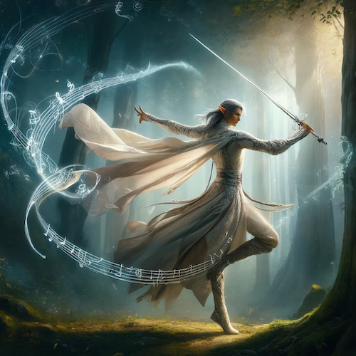

# Pieśniarz Klingi

### (KLASA PRESTIŻOWA)

> _Pieśniarze Klingi to elfy lub półelfy wychowane wśród elfiej społeczności, które łączą sztukę, szermierkę i magię mistyczną w harmonijną całość. Zwodnicze piękno ich zwinnych ruchów i subtelnych manewrów bojowych skrywa zabójczą skuteczność bojową. Pieśniarze Klingi cieszą się specjalną pozycją w elfiej społeczności łącząc piękno magii i sztuki z mistrzowskimi zdolnościami bojowymi, co sprawia, że są oni szanowani przez inne elfy. Zazwyczaj służą jako wędrowni strażnicy i obrońcy elfiej społeczności jako całości, zamiast być związanymi z jedną konkretną osadą. Każdy elf potrafiący władać długim mieczem bądź rapierem oraz posiadający umiejętność rzucania zaklęć mistycznych może stać się Pieśniarzem Klingi._
>
> _Większość Pieśniarzy Klingi działa w pojedynkę, dzięki umiejętnościom zapewniającym im dużą samowystarczalność. Zdarza się jednak, że w większych społecznościach będą mieli możliwość walczyć ramię w ramię z innymi przedstawicielami tej profesji. Nowi Pieśniarze Klingi są zazwyczaj szkoleni pojedynczo przez innego Pieśniarza Klingi. Nie istnieje żaden sformalizowany sposób nauki tej profesji jak "Szkoła Pieśniarzy Klingi" - dla elfów sam taki koncept brzmi absurdalnie._

---

### Podstawowe informacje

**Maksymalna ilość poziomów:** 10.\
**Kość Wytrzymałości:** k8.\
**Punkty Umiejętności:** 3 + Modyfikator Inteligencji.\
**Bazowa premia do ataku:** wysoka\
**Wysoki rzut obronny:** Refleks, Wola\
**Czary:** Co drugi poziom Pieśniarza Klingi czas trwania rzucanych zaklęć oraz ich efektywny poziom zwiększa się tak, jakby zdobył poziom w klasie barda, czarodzieja lub czarownika. Liczba znany zaklęć się jednak nie powiększa.

### Wymagania
**Bazowa premia do ataku:** +5\
**Rzucanie zaklęć mistycznych 1 kręgu**\
**Atuty:** Magia w Walce, Wyspecjalizowanie, Ulubiona broń (rapier lub długi miecz), Uniki\
**Umiejętności:** Koncentracja (4), Upadanie (3), Aktorstwo (3)\
**Rasa:** Elf lub półelf\
**Specjalne:** Musi wyznawać bóstwo z Panteonu Elfów

### Umiejętności
Akrobatyka\
Aktorstwo\
Czaroznastwo\
Dyscyplina\
Koncentracja\
Parowanie\
Prowokacja\
Wiedza (Szlachta i Władcy)\
Wiedza (Tajemna)

### Zdolności klasowe

**Poziom 1: Pieśń Klingi**

Pieśniarz Klingi dzierżący w prawej ręce rapier (i nic w drugiej) jest w stanie użyć trzy razy dziennie zdolności czaropodobnej dającej mu +1 premii do KP za unik, za każdy punkt modyfikatora z intelektu (ale nie więcej niż poziom w klasie Pieśniarza). Czas trwania umiejetności to godzina/poziom Pieśniarza Klingi.\
KP z tego atutu nie sumuje się z KP uzyskanym za atut [Sprytna Obrona](https://wiki.nwn.net.pl/docs/Nowe%20Klasy/Szermierz#zdolno%C5%9Bci-klasowe) z klasy Szermierza.

**Poziom 2: Premiowy Atut**

Pieśniarz Klingi może wybrać premiowy atut z listy: Dowolny atut metamagiczny, atak z doskoku, rozbrojenie, ulepszone rozbrojenie, ulepszone trafienie krytyczne (rapier), ulepszone trafienie krytyczne (długi miecz), uniki, mobilność.

**Poziom 3: Płacząca Klinga**

Pieśniarz Klingi wykorzystując 1 użycie 'Pieśni Barda' jest w stanie nadać swojej broni tymczasowe właściwości 'Ostrość' oraz +1 obrażeń dźwiękowych. Efekt utrzymuję się turę/poziom Pieśniarza.

**Poziom 5: Premiowy Atut**

**Poziom 6: Wrzeszcząca Klinga**

Działa jak 'Płacząca Klinga' z tą różnicą iż obrażenia dźwiękowe zostają powiększone do k4.

**Poziom 8: Premiowy Atut**

**Poziom 9: Wojenna Biegłość**

Szansa na niepowodzenie rzucenia zaklęcia wtajemniczeń, wynikającą przez noszenie zbroi, zostaje zmniejszona o 15%.

**Poziom 10: Wojenny Lament**

Działa jak 'Płacząca Klinga' z tą różnicą iż obrażenia dźwiękowe zostają powiększone do k6. Ponad to broń uzyskuje właściwość Potężnego Trafienia Krytycznego +k10.
