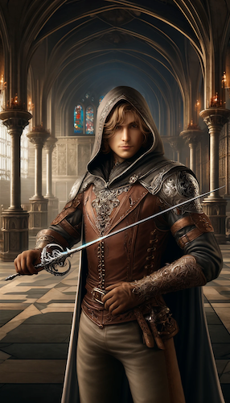

# Szermierz

### (KLASA PRESTIŻOWA)

Szermierz (czasem zwany zawadiaką) jest zwinnym i inteligentnym wojownikiem, który umie wyprowadzać precyzyjne ataki bronią lekką, taką jak rapier. W walce przede wszystkim wykorzystuje spryt oraz refleks. Rezygnuje z ciężkich pancerzy, wiedząc, że najlepszy sposób na wygraną to nie dać się w ogóle trafić.
Typowy BN należący do tej klasy prestiżowej to samotnik szukający przygody oraz szybkiego i łatwego zarobku. Czasem Szermierze działają w grupach, zgranych i wyszkolonych pod względem taktycznym - najczęściej jako najemnicy.

**Kość Wytrzymałości:** k10.\
**Punkty Umiejętności:** 3 + Modyfikator Inteligencji.\
**Bazowa premia do ataku:** wysoka\
**Wysoki rzut obronny:** Refleks

### Wymagania
**Bazowa premia do ataku:** +6\
**Atuty:** Finezja w Walce, Uniki, Mobilność, Wyspecjalizowanie\
**Umiejętności:** Akrobatyka (5)

### Umiejętności
Akrobatyka\
Blef\
Dyscyplina\
Parowanie\
Prowokacja\
Spostrzegawczość\
Wiedza (Szlachta i Władcy)\
Wyczucie Pobudek\
Zastraszanie

### Zdolności klasowe

**Poziom 1: Sprytna Obrona**

Szermierz dzierżący w prawej ręce lekką, finezyjną broń (i nic w drugiej), bez zbroi, jest w stanie użyć trzy razy dziennie zdolności czaropodobnej dającej mu +1 premii do KP za unik, za każdy punkt modyfikatora z intelektu (ale nie więcej niż poziom w klasie Szermierza). Czas trwania umiejetności to godzina/poziom Szermierza.

**Poziom 2: Oślepiająca Szybkość**

Szermierz może skorzystać ze zdolności czaropodobnej odpowiadającej zaklęciu Przyspieszenie maga 10 poziomu (+4 KP za Uniki, +50% prędkości poruszania się, dodatkowy atak). Na 4 poziomie może użyć tej umiejętności 2 razy dziennie, na szóstym - 3, na ósmym - 4 i na dziesiątym 5 razy.

**Poziom 4: Gracja**

Szermierz uzyskuje za darmo atut 'Ulepszony Refleks', jeśli nie posiadał go wcześniej.

**Poziom 5: Doskonałe Pchnięcia**

Szermierz raz dziennie jest w stanie skupić się by przeprowadzać śmiertelnie niebezpieczne ciosy. Przez turę/2 poziomy dodaje poziom w klasie Szermierza do zadawanych obrażeń bronią finezyjną w walce wręcz. Na 10 poziomie czas trwania tej zdolności zwiększa się do tury/poziom w tej klasie.

**Poziom 7: Kunsztowne Parowanie**

Szermierz uzyskuje za darmo atut 'Ulepszone Parowanie'.

**Poziom 9: Odbijanie Strzał**

Szermierz uzyskuje za darmo atut 'Odbijanie Strzał'.

