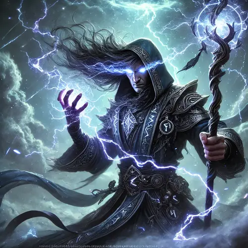

# Władca Burz

### (KLASA PRESTIŻOWA)
Władcy Burz są agentami Talosa, siejącymi spustoszenie i zniszczenie, gdziekolwiek się pojawią. Talos dba jedynie o to, by wywoływali burze lub dokonywali widowiskowych aktów przemocy. Władcy Burz często żyją jak zbóje, oddając się swoim osobistym pragnieniom bogactwa, jedzenia, luksusu i rozpusty, jednocześnie łaknąc chaotycznych, spektakularnych aktów przemocy. Władcą Burz zostają Druidzi lub Kapłani wyznający Talosa.

**Maksymalna ilość poziomów:** 10.\
**Kość Wytrzymałości:** k8.\
**Punkty Umiejętności:** 3 + Modyfikator Inteligencji.\
**Bazowa premia do ataku:** średnia\
**Wysoki rzut obronny:** Siła Woli, Wytrwałość\
**Czary na dzień/znane czary:** Co poziom Władcy Burz liczba rzucanych przez niego czarów kapłańskich na dzień zwiększa się tak, jakby zdobył poziom w klasie czarującej.

### Wymagania
**Charakter:** Dowolny nie-dobry i nie-praworządny\
**Rzucanie zaklęć objawień 3 kręgu (kapłan lub druid)**\
**Atuty:** Większa wytrzymałość, ulubiona broń (włócznia lub krótka włócznia)\
**Specjalne:** Musi wyznawać Talosa.

### Umiejętności
Koncentracja\
Wiedza (Natura)\
Wiedza (Religia)\
Wyczucie pobudek\
Zastraszanie

### Zdolności klasowe

**Poziom 1: Odpornośćna elektryczność 10**

Władca Burz otrzymuje 10 redukcji obrażeń od elektryczności.

**Poziom 1: Żywiołak chaosu**

Władca Burz raz na dzień jest w stanie przywołać chaotycznego żywiołaka. Jego siła rośnie na 5 i 10 poziomie w klasie.

**Poziom 2: Włócznia Piorunów**

Jeżeli Władca Burz używa dowolnej włóczni, jest ona traktowana jako broń elektryczna (+1d6 obrażeń elektrycznych)

**Poziom 4: Odporność na elektryczność 15**

Władca Burz otrzymuje 15 redukcji obrażeń od elektryczności.

**Poziom 5: Włócznia Gromu**

Jeżeli Władca Burz używa dowolnej włóczni, traktowana jest ona jako broń soniczna (+1d8 obrażeń od dźwięku). Ta umiejętność kumuluje się z Włócznią Piorunów.

**Poziom 7: Odporność na elektryczność 20**

Władca Burz otrzymuje 20 redukcji obrażeń od elektryczności.

**Poziom 8: Włócznia Porażenia**

Jeżeli Władca Burz używa dowolnej włóczni, jego trafienia krytyczne porażają wrogów (+1d10 obrażen elektrycznych przy trafieniu krytycznym). Ta umiejętność kumuluje się z Włócznią Piorunów i Włócznią Gromu.

**Poziom 9: Niewrażliwość na obrażenia elektryczne**

Kompletna niewrażliwość na obrażenia od elektryczności. (100% redukcji)

