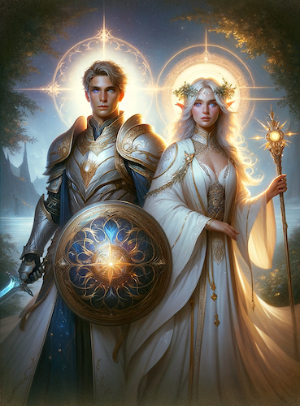

# Aasimar

### Rasa prestiżowa
Aby ubiegać się o autoryzację gry rasą prestiżową, wymagany jest co najmniej [Status Gracza na poziomie Złoty](https://wiki.nwn.net.pl/docs/Systemy%20Autorskie/Zdobywanie%20doswiadczenia#status-gracza).\
Dodatkowo, przed rozpoczęciem gry Aasimarem należy wysłać kartę postaci do MG. Ekipa serwera zastrzega sobie prawo do odrzucenia kart, które zawierają niespójne lub dziwne informacje (np. postać jest potomkiem bóstwa).

### Opis rasy
Pełne wdzięku i szlachetne aasimary noszą w swojej krwi dziedzictwo niebian bądź nawet bóstw. Choć nie są tak potężni jak ich niebiańscy przodkowie, ich pochodzenie jest źródłem ich dumy, dającym im niezwykły potencjał do czynienia dobra w świecie. Na ogół wysocy i atrakcyjni, na pierwszy rzut oka wyglądają jak ludzie, jednak łatwo zauważyć którąś z cech szczególnych wynikającą z ich pochodzania. Mogą to być m.in. (choć lista ta nie jest wyczerpująca): złote oczy, srebrne włosy, szmaragdowa skóra, pokrywające ramiona pióra, pióra we włosach, perłowe, opalizujące oczy, potężny, dźwięczny głosy, topazowe oczy, srebrna bądź złota skóra, łaty mieniących się łusek na ciele. Dwóch aasimarów o takim samym pochodzeniu często posiada podobne cechy szczególne. \
Ich długość życia i wiek osiągnięcia dojrzałości jest taki sam jak u ludzi.

### Charakter
Większość aasimarów ma dobry charakter. Walczą ze złem i próbują skłaniać innych do dobrych uczynków.

### Ulubiona klasa
Ulubioną klasą aasimarów jest paladyn.

### Specjalne cechy wyglądu
Aasimar może otrzymać anielskie skrzydła po konsultacji z MG, nie jest to jednak reguła a bardziej nagroda za wyjątkowo staranną Kartę Postaci lub ciekawy pomysł na fabułę.
Istnieją jednak inne ścieżki na uzyskanie skrzydeł, np. udział w przygodzie związanej z anielskim dziedzictwem lub zdobycie specjalnego przedmiotu w grze.

### Rodowity przybysz
Aasimar, jako rodowity przybysz, jest odporny na zaklęcia wpływające na humanoidy, takie jak Zauroczenie Osoby. Działa na niego natomiast Związanie Sfer oraz specjalna broń wzmocniona przeciwko istotom ze sfer. \
Rodowici przybysze, jako że mają ludzkich przodków, posiadają silny związek z Planem Materialnym. Można ich ożywić, zreinkarnować czy wskrzesić tak jak inne żywe istoty. Są natywni dla Planu Materialnego i w przeciwieństwie do pozasferowców, potrzebują pożywienia i snu.

### Dostosowanie poziomu
Obowiązuje dostosowanie poziomu +1 (aasimar na 1 poziomie otrzymuje PD za potwory tak, jakby był postacią 2 poziomu).

### Cechy rasowe
**Aasimar otrzymuje następujące właściwości rasowe:**

- Premia do cech: +2 Mądrość, +2 Charyzma
- Odporność na Zimno, Kwas i Elektryczność: 5/-
- Talenty w umiejętnościach Spostrzegawczość i Nasłuchiwanie
- Widzenie w Ciemności
