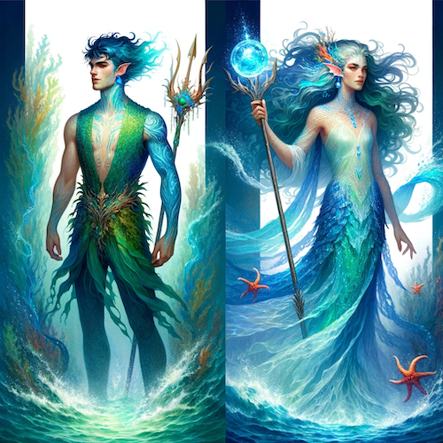

# Genasi Wody

### Rasa podstawowa
Genasi wody nie wymaga autoryzacji, oznacza to, że można założyć taką postać i natychmiast dołączyć do gry (nawet bez wysyłania karty postaci).

### Opis rasy
Genasi to mieszańcy, potomkowie najczęściej (chociaż nie w każdym przypadku) ludzi i dżinnów lub żywiołaków, zaliczani do Planokrwistych. Są naznaczeni esencją żywiołu wody, który znajduje swoje odzwierciedlenie w ich wyglądzie, umiejętnościach, ale także i charakterze.

Podobnie jak inni planokrwiści, genasi wody ogólnym wyglądem przypominają ludzkich rodziców, posiadają jednak zawsze co najmniej dwie widoczne, wyróżniające ich cechy związane ze swoim wodnym pochodzeniem. Mogą mieć skórę barwy niebieskiej lub zielonej, może też ona być nienaturalnie wilgotna czy pokryta drobną łuską w całości lub w niektórych miejscach. Ich włosy również mogą być niebieskie lub zielone, czasami podobne do wodorostów, a między palcami może pojawić się błona, co potrafi upodobnić ich do wodnych elfów. Zdarza się, że ich głos brzmi jakby był zniekształcony przez wodę.

### Charakter
Dowolny (ze skłonnością do Chaotycznego). Genasi wody z natury mają tendencję do skrajnych, ekstremalnych zachowań i wahań nastrojów niczym zmienność morza - mogą w jednej chwili być spokojne, by w następnej wpaść we wściekłość.

### Ulubiona klasa
Dowolna.

### Rodowity przybysz
Genasi wody, jako rodowity przybysz, jest odporny na zaklęcia wpływające na humanoidy, takie jak Zauroczenie Osoby. Działają na niego natomiast zaklęcia wpływające na przybyszów oraz specjalna broń wzmocniona przeciwko istotom ze sfer.

### Dostosowanie poziomu
Obowiązuje dostosowanie poziomu +1 (genasi na 1 poziomie otrzymuje PD za potwory tak, jakby był postacią 2 poziomu).

### Cechy rasowe
**Genasi wody otrzymuje następujące właściwości rasowe:**

- Cechy: +2 Kondycja, -2 Charyzma
- Premia do rzutów obronnych przeciwko typowi Zimno: +4
- Widzenie w Ciemności
- Oddychanie pod wodą
- Zdolność fabularna: Wodny dotyk

### Wodny dotyk

Raz dziennie genasi wody może dotykiem ugasić pochodnie, ogniska i inne otwarte płomienie niemagicznego pochodzenia, jeśli są rozmiaru średniego, efekt działania jest natychmiastowy.