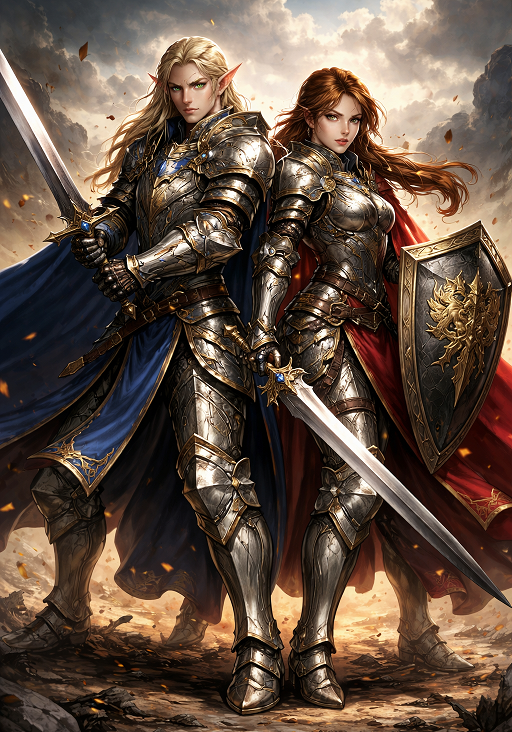

# Rycerz

## (KLASA PODSTAWOWA)
> Rycerz to wojownik ukształtowany przez etos rycerski: honor, dyscyplinę, lojalność i wagę danego słowa. Dla rycerza liczy się nie tylko wynik, ale też sposób, w jaki do niego doszło. W praktyce oznacza to przywiązanie do formy, opanowanie w działaniu i przekonanie, że reputacja jest czymś, co buduje się latami, a traci w jednej chwili. Rycerze często noszą barwy, znaki i symbole, bo ich tożsamość jest powiązana z rodem, zakonem, panem feudalnym albo sprawą, której służą.
> 
> Rycerze są zawsze praworządni. Ich oddanie kodeksowi postępowania to tylko jeden z przejawów ich oddania porządkowi. Większość zakonów rycerskich powstaje jako instytucje powołane do ochrony królestwa przed najeźdźcami lub egzekwowania prawa przeciwko chaosowi od wewnątrz.\ 
> Chociaż rycerze cenią porządek, w równym stopniu skłaniają się ku dobru, złu i neutralności. Praworządni dobrzy rycerze postrzegają porządek jako narzędzie ochrony niewinnych i słabych przed złem. Praworządni źli rycerze wierzą, że porządek społeczny służy nagradzaniu silnych. Praworządni neutralni rycerze brzydzą się zniszczeniem i cierpieniem, jakie może przynieść chaos, i dlatego podtrzymują porządek dla niego samego.
>
> **Kodeks Rycerski**: Walczysz nie tylko po to, by pokonać wrogów, ale by udowodnić swój honor, zademonstrować swoje umiejętności walki i zdobyć sławę w całym kraju. Historie, które wynikają z twoich czynów, są dla ciebie równie ważne, jak same czyny. Dobry rycerz ma nadzieję, że jego przykład zachęci innych do prowadzenia prawego życia. Neutralny rycerz pragnie bronić sprawy swojego Pana/Zakonu (jeśli go posiada) i zdobyć chwałę. Zły rycerz pragnie zdobyć sławę w całym kraju i zwiększyć swoją osobistą moc.

**Kość Wytrzymałości:** WIP.\
**Biegłości:** WIP.\
**Punkty Umiejętności:** WIP.\
**Bazowa premia do ataku:** WIP\
**Wysoki rzut obronny:** WIP

## Wymagania
Przed rozpoczęciem gry rycerzem należy wysłać [kartę postaci](https://wiki.nwn.net.pl/karta-postaci) do MG. Dopiero po jej zatwierdzeniu można rozpocząć rozgrywkę.\
W formularzu muszą się znaleźć wszystkie planowane klasy, zarówno podstawowe, jak i prestiżowe.

## Ograniczenia
Tworząc postać rycerza należy wziąć pod uwagę następujące ograniczenia fabularne.

### Dobór klas
Z czym się **nie może** łączyć rycerz:
- Łotrzyk
- Żeglarz
- Druid
- Szaman
- Czarny Strażnik
- Mistyczny Sztukmistrz
- Mistyczny Łucznik
- Tancerz Cieni
- Zabójca
- Zmiennokształtny
- Harfiarz Zwiadowca
- Blady Mistrz

### Uzywanie broni
Bronie których rycerz **nie może** używać:
- Dystansowe bronie (kusza/łuk/proca/inne) - gdyż są widziane jako bronie niehonorowe, rycerz chce walczyć w twarzą w twarz ze swoim przeciwnikiem oraz jest widziana jako broń niższych sfer.
- Bronie chłopskie (czyli np kosa czy sierp) - ze względu na kojarzenie się z oddziałami bardziej chłopskimi niż bronią rycerską.
- Broń podstępna - wszystkie zatrute ostrza, trucizny, ukryte ostrza itp są dla rycerza broniami nie honorowymi.

## Umiejętności
WIP

## Zdolności klasowe

WIP
