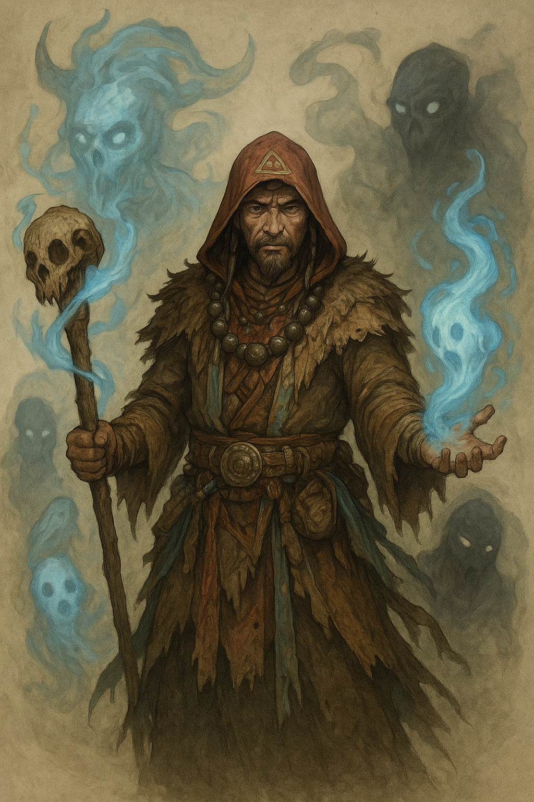

# Szaman

### (KLASA PODSTAWOWA)
Mistrz świata duchów, szaman duchowy, wyznaje inną boską tradycję niż tradycja kapłana czy druida. Ich świat jest pełen potężnych, żywych duchów, niektórych pomocnych i innych złośliwych. Targując się z tymi duchami, duchowy szaman zyskuje władzę nad światem natury i potężną boską magię, za pomocą której może pomóc swoim towarzyszom lub uderzyć wrogów. Do stworzeń uważanych za duchy zaliczają się istoty magiczne, żywiołaki i bezcielesni nieumarli, tacy jak upiory i cienie.

Profesja szamana jest nierozerwalnie zdefiniowana przez pochodzenie etniczne, a jego rozwój fabularny stanowi pogłębienie tradycji regionalnej. Każdy wybór musi być zgodny z kodeksem kulturowym, by nie kolidował z tabu danego ludu. Ostatecznie to dziedzictwo regionalne decyduje, czy stalowa zbroja lub nowa ścieżka mocy są akceptowalne w oczach przodków i duchów krainy.\
Tworząc szamana, najpierw wybierz jego lud i region, a następnie dobierz klasy i sprzęt tak, aby były one logicznym przedłużeniem jego korzeni. Szaman odziany w skórznię z Ruathym jest tak samo poprawny, jak niemal nagi mistyk z Rashemenu (dopóki ich ekwipunek służy tradycji). Odziani w zbroje płytowe nie byliby poprawni. 

**Kość Wytrzymałości:** k8.\
**Biegłości:** może posługiwać się bronią prostą i lekkimi pancerzami.\
**Punkty Umiejętności:** 5 + Modyfikator Inteligencji.\
**Bazowa premia do ataku:** średnia\
**Wysoki rzut obronny:** Wytrwałość, Siła Woli

### Umiejętności
Czaroznawstwo\
Dyplomacja\
Koncentracja\
Leczenie\
Wiedza (Religia)\
Wiedza (Tajemna)\
Zrozumienie Zwierząt

### Zdolności klasowe

**Poziom 1: Odpędzanie Nieumarłych**

**Poziom 1: Używanie Trucizn**

**Poziom 6: Bonusowy atut - Tworzenie Różdżek**

**Poziom 8: Talent Magiczny (Poznanie)**

**Poziom 16: Większy Talent Magiczny (Poznanie)**

**Poziom 23: Dodatkowy atut**

**Poziom 26: Dodatkowy atut**

**Poziom 29: Dodatkowy atut**

**Poziom 32: Dodatkowy atut**

**Poziom 35: Dodatkowy atut**

**Poziom 38: Dodatkowy atut**
