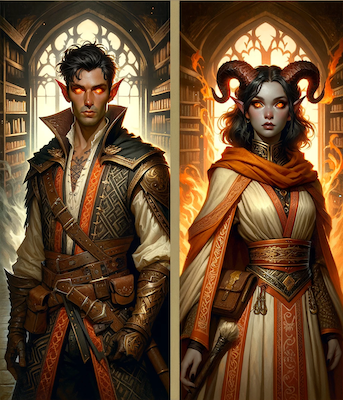

# Diabelstwo

### Rasa prestiżowa
Przed rozpoczęciem gry Diabelstwem należy wysłać kartę postaci do MG. Ekipa serwera zastrzega sobie prawo do odrzucenia kart, które zawierają niespójne lub dziwne informacje (np. postać jest potomkiem bóstwa).

### Opis rasy
Diabelstwa zwane również diablętami (ang. tiefling) to ludzie, którzy posiadają domieszkę czarciej krwi.

Te istoty od ludzi różni czasem nie tylko wspomniana aura, która oczywiście często budzi niepokój. Nieliczne diabelstwa mają różki, igiełkowate zęby, czerwone oczy, kopyta lub otacza je woń siarki. W większości ludzkich społeczności diabelstwa żyją na marginesie - są złodziejami, zabójcami lub szpiegami. Czasami zdobywają władzę, lecz gdy ujawni się ich natura, szybko stają się wyrzutkami. Diabelstwa to istoty podstępne, subtelne i lubujące się w spiskach. Najchętniej atakują z zasadzki, a jeśli to możliwe, unikają uczciwej walki.

### Charakter
Diabelstwa są niegodziwe i przebiegłe. Zwykle dziedziczą skłonność do czynienia zła i nie walczą z nią. Niewielu opiera się wrodzonej naturze. Jeśli coś takiego czynią, muszą z jednej strony walczyć ze stereotypami (oczywiście pod warunkiem, że rozpoznano ich pochodzenie), a z drugiej z poczuciem, iż innoplanowe zło podąża za nimi krok w krok.

### Ulubiona klasa
Ulubioną klasą diabelstw jest łotrzyk.

### Specjalne cechy wyglądu
Diabelstwo może otrzymać demoniczne skrzydła/ogon po konsultacji z MG, nie jest to jednak reguła a bardziej nagroda za wyjątkowo staranną Kartę Postaci lub ciekawy pomysł na fabułę.

Istnieją jednak inne ścieżki na uzyskanie skrzydeł/ogona, np. udział w przygodzie związanej z diabelskim dziedzictwem lub zdobycie specjalnego przedmiotu w grze.

### Rodowity przybysz
Diabelstwo, jako rodowity przybysz, jest odporne na zaklęcia wpływające na humanoidy, takie jak Zauroczenie Osoby. Działają na nie natomiast zaklęcia wpływające na przybyszów oraz specjalna broń wzmocniona przeciwko istotom ze sfer.

### Cechy rasowe
**Diabelstwo otrzymuje następujące właściwości rasowe:**

- Premia do cech: +2 Zręczność, +2 Inteligencja, -2 Charyzma
- Odporność na Ogień, Zimno i Elektryczność: 5/-
- Talenty w umiejętnościach Blef i Ukrywanie
- Widzenie w Ciemności