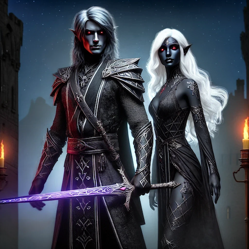

# Drow

### Rasa prestiżowa
Przed rozpoczęciem gry Drowem należy wysłać kartę postaci do MG. Ekipa serwera zastrzega sobie prawo do odrzucenia kart, które zawierają niespójne lub dziwne informacje (np. postać nazywa się Drizzt Do'Urden).

### Opis rasy
Drowy, zwane potocznie mrocznymi elfami, powstały z elfów, które skorumpowane przez Lolth podążyłyseldarine za nią ścieżką zła. To spowodowało nałożenie przez Seldarine klątwy na drowy, której efektem jest ich charakterystyczny wygląd - skóra o barwie wygładzonego obsydianu i białe bądź bladożółte włosy. Oczy mrocznych elfów są zwykle czerwone. Inne kolory, takie jak blade odcienie liliowego, srebrnego, różowego czy niebieskiego też się zdarzają, lecz są nieporównywalnie rzadsze. Również budową ciała odstają oni od elfów z powierzchni będąc niższymi i smuklejszymi niż ich pobratymcy. Ich długość życia oraz wiek osiągnięcia dojrzałości nie różni się od pozostałych elfów. Tradycyjnie społeczeństwo drowów jest mocno zhierarchizowanym społeczeństwem matriarchalnym, na którego czele stoi kapłanka Lolth. Warto też dodać, że drowy mają głęboko zakorzenione zamiłowanie do podstępu, przebiegłości i niespodziewanego ostrza w mroku.

Na serwerze Kronik Neverwinter drowy są nieliczną grupą zamieszkującą powierzchnię. Postać gracza może należeć do związanych głównie z miastem Luskan czcicieli Vhaerauna (drowy o charakterze złym) lub zamieszkujących obóz w Górach Miecza wyznawców Eilistraee.

### Charakter
Większość drowów jest całkowicie zła. Nieliczne, które nie są złe, często nie mają dość okrucieństwa, by przetrwać w ich brutalnym społeczeństwie. Z tego powodu wiele z nich opuszcza podziemne krainy drowów i wyrusza na przygody. Drowy o dobrym charakterze są niezwykle rzadkie, ale nie niemożliwe do spotkania.

### Ulubiona klasa
Ulubioną klasą drowów jest czarodziej.

### Dostosowanie poziomu
Obowiązuje dostosowanie poziomu +2 (drow na 1 poziomie otrzymuje PD za potwory tak, jakby był postacią 3 poziomu).

### Cechy rasowe
**Drow otrzymuje następujące właściwości rasowe:**

- Premia do cech: +2 Zręczność, -2 Kondycja, +2 Inteligencja, +2 Charyzma
- Odporność na zaklęcia: 1 punkt na poziom postaci
- Bezsenność: odporność na zaklęcia i efekty 'uśpienia'.
- Odporność na Zaklinanie: premia +2 do rzutów obronnych przeciwko zaklęciom oddziałującym na umysł.
- Dodatkowe biegłości (krótki miecz, rapier, lekka kusza, ciężka kusza).
- Premia do umiejętności (Nasłuchiwanie): +2 do testów Nasłuchiwania.
- Premia do umiejętności (Przeszukiwanie): +2 do testów Przeszukiwania.
- Premia do umiejętności (Spostrzegawczość): +2 do testów Spostrzegawczości.
- Wyostrzone zmysły: drowy mogą aktywnie przeszukiwać otoczenie bez kar do ruchu.
- Widzenie w Ciemności
- Zdolność czaropodobna: Ciemność, 1x dziennie

**Drow technicznie jest rozpoznawalny przez silnik gry jako elf.** Oznacza to, może używać przedmiotów stworzonych dla elfów (Ograniczenie używania: rasa: Elf), działa przeciwko niemu wróg rasowy Elfy, oraz magiczne przedmioty ulepszone przeciwko elfom.
