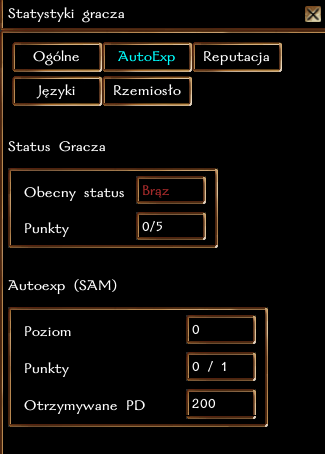

# Podstawowe informacje

## System Autoexpa Mefisto (SAM)

Postać otrzymuje co godzinę **200 XP + 75** za każdy poziom autoexpa.
Poziomy autoexpa zdobywa się dzięki punktom od MG przyznawanym za odgrywanie.

| Poziom autoexpa | Nagroda |
|-----------------|---------|
| 0               | 200     |
| 1               | 275     |
| 2               | 350     |
| ...             | ...     |

### Modyfikator czasu gry

- W pierwszych dwóch godzinach czasu gry postać otrzymuje podwójny autoexp. 
- Trzecia i kolejna godzina to 50% bazowego autoexpa.

### Uzależnienie "maksymalnego poziomu" od punktów SAM, wg. poniszego wzoru:
0-1 punktów SAM: max 11 poziom\
2-3 punkty SAM: max 12 poziom\
4-5 punkty SAM: max 14\
6-7 punktów SAM: max 16\
8-9 punktów SAM: max 18\
10-19 punktów SAM: max 20\
20 punktów SAM: bez ograniczeń

#### Jak to działa? 
- jeśli mam 0 punktów SAM, mogę uzyskać maksymalnie 11 poziom, po czym PD za potwory zostaną zablokowane
- jeśli mam 2 punkty SAM, mogę uzyskać maksymalnie 12 poziom, po czym PD za potwory zostaną zablokowane\
...
- jeśli mam 10 punktów SAM, mogę uzyskać maksymalnie 20 poziom, po czym PD za potwory zostaną zablokowane

#### Ratunku, nigdy nie miałem więcej niż 1 punkt SAM! Jak grać?!
Dzięki nowemu systemowi, a.k.a. "Storytelling", MG będą mogli obserwować każdy ruch twojej postaci i każdą odgrywkę, nawet jeśli w danym momencie nie będzie MG na serwerze. Umożliwi to lepsze przyznawanie nagród i punktów SAM (tak, nawet dla postaci nie biorących udziału w przygodach - np. ze względu na grę w "dziwnych" porach dnia; wystarczy odgrywać). 

:::info

Blokada PD nie objemuje rzemiosła, odgrywania ani Autoexpa. 

:::

## Status Gracza

Za każdy przyznany przez MG punkt SAM, na dowolnej postaci gracza (na tym samym kluczu gry), gracz otrzymuje 1 punkt do statusu. 
**Przykład**: do uzyskania statusu "Srebrnego" wystarczy 5 punktów SAM na jednej postaci lub po 1 punkcie SAM na pięciu postaciach.

Im wyższy status, tym lepsze premie zapewnia, zgodnie z tabelką poniżej.

| Status | Wymagane punkty | Premia |
|--------|-----------------|--------|
| Brąz   | 0               |-|
| Srebrny   | 5            |Wszystkie twoje nowe postacie będą otrzymywać 2 pkt SAM na start.|
| Złoty   | 10             |Wszystkie twoje nowe postacie będą otrzymywać 5 pkt SAM na start.|
| Platynowy   | 20             |Wszystkie twoje nowe postacie będą otrzymywać 10 pkt SAM na start.|

:::info

Premie nie są przyznawane wstecz, więc zdobycie nowego statusu nie podnosi automatycznie Autoexpa na wszystkich postaciach. 
Premie są przyznawane tylko nowym postaciom, po przejściu przez portal do świata gry.

:::

:::warning

Punkty do statusu gracza nie są naliczane wstecz, na podstawie punktów SAM zdobytych w trakcie bety!

:::

## Storytelling bonus

Mistrzowie Gry mają możliwość obdarowania graczy dodatkowym doświadczeniem za rozwijanie swoich wątków poza grą. Taki bonus może być wydany za przesyłanie kontynuacji wątków fabularnych poprzez [Storytelling](https://wiki.nwn.net.pl/docs/Systemy%20Autorskie/Storytelling) bądź za pisanie pamiętanika czy historii postaci na [publiczym kanale Discord](https://discord.com/channels/752493729289601025/1287497301144633396).

- Storytellig bonus jest przydzielany manulanie przez MG, dla konkretnej postaci za konkretną notkę fabularną.
- Postać otrzymuje doświadczenie w grze - jeśli jest zalogowana dostaje je od razu (informacja w logu).
- Jeśli jest akurat offline, doświadczenie i info w logu wpadną po najbliższym zalogowaniu.
- W przyszłości informacja w logu będzie precyzować za co dokładnie przyznany został dany Storytelling bonus.

## Doświadczenie za odgrywanie

W miarę odgrywania w grze na kanale "Rozmowa" i "Szept", postać co jakiś czas dostaje trochę doświadczenia.\
Częstość otrzymywania XP za odgrywanie zależy od wielu zmiennych, takich jak: ilość osób biorących udział w odgrywce oraz długość i częstotliwość pisanego tekstu (minimalnie 3 minuty, w praktyce 5-15 minut).

## Limity doświadczenia za zabijanie potworów

Po zabiciu **20 potworów** jednego rodzaju, otrzymywane doświadczenie jest zmniejszone o **50%**. Limit ten obowiązuje przez **2 godziny**. 

Dodatkowo, jeżeli postać przekroczy w ciągu dnia 5000 punktów doświadczenia zdobytych na potworach, doświadczenie zostanie dodatkowo zmniejszone do **20%** bazowej wartości. Limit ten obowiązuje **do restartu serwera**. 

Oba typy limitów sumują się, czyli 50% z 20% punktów daje 10% bazowej wartości. 

## Kary za wieloklasowość

Wieloklasowcy otrzymują karę -20% doświadczenia zdobywanego za potwory, zgodnie ze [**standardowaymi zasadami gry**](https://nwn.fandom.com/wiki/Multiclass_penalty).

## Punkty doświadczenia wymagane do awansu
Ilość PD wymaganych do awansu została zwiększona o dodatkowe 10.000 na poziomach powyżej 10. 

Np. 11 poziom oryginalnie wymagał 55.000, obecnie wymaga 65.000. 13 poziom to już 108.000 (oryginalne 78.000 + 3 * 10.000).

| Poziom | Wymagane punkty doświadczenia |
|--------|-------------------------------|
| 1      | 0                             |
| 2      | 1000                          |
| 3      | 3000                          |
| 4      | 6000                          |
| 5      | 10000                         |
| 6      | 15000                         |
| 7      | 21000                         |
| 8      | 28000                         |
| 9      | 36000                         |
| 10     | 45000                         |
| 11     | 65000                         |
| 12     | 86000                         |
| 13     | 108000                        |
| 14     | 131000                        |
| 15     | 155000                        |
| 16     | 180000                        |
| 17     | 206000                        |
| 18     | 233000                        |
| 19     | 261000                        |
| 20     | 290000                        |
| 21     | 320000                        |
| 22     | 351000                        |
| 23     | 383000                        |
| 24     | 416000                        |
| 25     | 450000                        |
| 26     | 485000                        |
| 27     | 521000                        |
| 28     | 558000                        |
| 29     | 596000                        |
| 30     | 635000                        |
| 31     | 675000                        |
| 32     | 716000                        |
| 33     | 758000                        |
| 34     | 801000                        |
| 35     | 845000                        |
| 36     | 890000                        |
| 37     | 936000                        |
| 38     | 983000                        |
| 39     | 1031000                       |
| 40     | 1080000                       |
