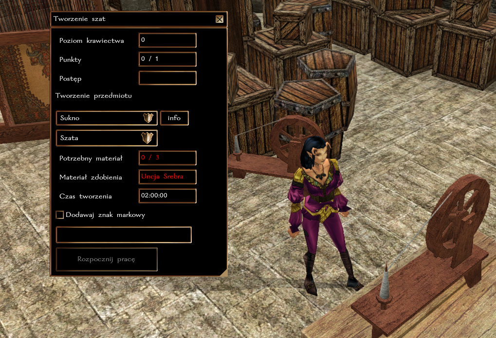
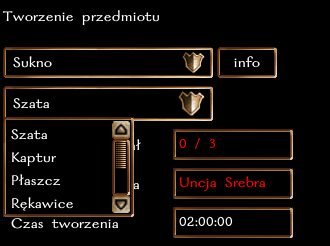
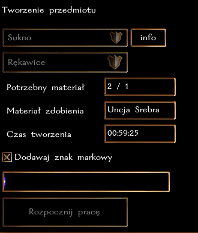

## Ogólne zasady

Krawiectwo pozwala na szycie szat, rękawic, kapturów i płaszczy. Obecnie w grze występują 3 typy materiałów krawieckich, które są używane do rzemiosła: zwykle sukno, jedwab i karkaris. Przy pomocy stołu krawieckiego, postać może uszyć przedmiot.

**Każda próba uszycia przedmiotu kończy się sukcesem**, a im wyższy poziom rzemiosła tym potężniejszy przedmiot można stworzyć.

**Maksymalne ulepszenie, które można uzyskać to +6** (Szata z mithralowymi runami z 3 slotami na runę + 3 Runy Mocy). Dotyczy to zarówno KP, jak i Rękawic [Zręczność], Kapturów [Mądrość] i Płaszczy [Charyzma].

### Typ rzemiosła i działanie z innymi systemami

Krawiectwo jest rzemiosłem **czasochłonnym**, co oznacza, że szycie może potrwać od 1 do nawet 2 godzin czasu realnego. W tym czasie postać może robić co chce, nie trzeba być nawet zalogowanym. Po upłynięciu danego czasu wystarczy wrócić do stołu krawieckiego, aby sfinalizować proces tworzenia.

Postać może wytwarzać tylko jeden przedmiot w danym momencie, dotyczy to każdego rzemiosła, które jest oznaczone jako czasochłonne. Czyli można "jednocześnie" szyć płaszcze i szlifować kamienie/wytapiać sztaby (czynności natychmiastowe), a nawet łowić ryby lub kopać rudę (krótka czynność). Nie można jednak tworzyć broni i szyć jednocześnie (długie czynności).

### Poziomy wtajemniczenia

Nowicjusze w rzemiośle nie znają tajników pracy ze specjalnymi materiałami. Aby tworzyć jedwabną szatę potrzeba przynajmniej 8 poziomu krawiectwa. Karkarisowa szata wymaga aż 10 poziomu.

### Specjalne właściwości

**Szaty**

| Typ szaty            | Premia |
|----------------------|--------|
| Dobra                | +1 KP  |
| Piękna (jedwab)      | +2 KP  |
| Wspaniała (karkaris) | +3 KP  |

**Rękawice**

| Typ rękawic          | Premia       |
|----------------------|--------------|
| Dobre                | +1 Zręczność |
| Piękne (jedwab)      | +2 Zręczność |
| Wspaniałe (karkaris) | +3 Zręczność |

**Kaptury**

| Typ kaptura          | Premia     |
|----------------------|------------|
| Dobry                | +1 Mądrość |
| Piękny (jedwab)      | +2 Mądrość |
| Wspaniały (karkaris) | +3 Mądrość |

**Płaszcze**

| Typ płaszcza         | Premia      |
|----------------------|-------------|
| Dobry                | +1 Charyzma |
| Piękny (jedwab)      | +2 Charyzma |
| Wspaniały (karkaris) | +3 Charyzma |

### Przedmioty runiczne

Każdy krawiec ma szansę na wytworzenie przedmiotu z miejscami na runę. Zwykły przedmiot może mieć maksymalnie 1 runę, jedwabny 2, a karkarisowy 3.

Szansa na 1 miejsce na runę:\
``poziom Krawiectwa + poziomy w klasie łotra i barda vs k100``

Szansa na 2 miejsca na runę:\
``poziom Krawiectwa/2 + poziomy w klasie łotra i barda/2 vs k100``

Szansa na 3 miejsca na runę:\
``poziom Krawiectwa/5 + poziomy w klasie łotra i barda/5 vs k100``

### Znak markowy

Każdy krawiec może wybrać, aby zamieszczać swój znak markowy na wytwarzanych przedmiotach. W ten sposób, każdy będzie mógł określić pochodzenie przedmiotu.

### Rozwój rzemiosła

Za każde udane wytworzenie przedmiotu postać otrzymuje 1 punkt [cząstkowy] w rzemiośle. Osiągnięcie każdego nowego poziomu to także nagroda 100 + 5 * nowy poziom XP. Czyli uzyskanie 2 poziomu to 110 XP, trzeciego 115 XP, itd.

| Poziom Krawiectwa | Wymagane punkty |
|-------------------|-----------------|
| 2                 | 1               |
| 3                 | 3               |
| 4                 | 6               |
| 5                 | 10              |
| 6                 | 15              |
| ...               | ...             |

### Krok po kroku

