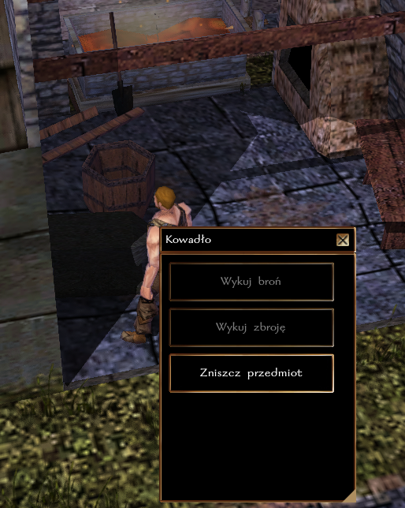
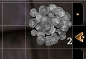
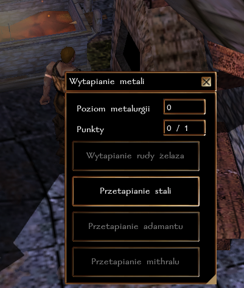

## Ogólne zasady

Metalurgia pozwala na wytapianie sztabek z rudy lub złomu. Sztabki można następnie sprzedawać u kowala lub wykuwać broń (u NPC w Port Llast lub własnoręcznie, przy pomocy kowadła).

### Pozyskiwanie materiału

Surowce potrzebne do rzemiosła można zdobywać na trzy sposoby.

1. Wydobycie rudy: [Górnictwo](./05-Gornictwo.md)
2. Zbieranie metalowych części (np. ze zniszczonego golema).
3. Złomowanie metalowych przedmiotów

Aby odzyskać metal ze znalezionego przedmiotu, wystarczy użyć kowadła u kowala, a następnie wskazać przedmiot do zniszczenia. Ilość odzyskanego metalu zależy od typu przedmiotu.

| Przedmiot      | Ilość odpadków po zniszczeniu |
|----------------|-------------------------------|
| Broń           | 2 - 4                         |
| Mała tarcza    | 2                             |
| Hełm           | 2                             |
| Duża tarcza    | 4                             |
| Pawęż          | 6                             |
| Zbroja Paskowa | 6                             |
| Zbroja Płytowa | 8                             |

### Proces metalurgiczny

Przy każdej próbie wytopienia sztabki, wykonuje się rzut wg. następującej formuły

``k20 + poziom Metalurgii + modyfikator Inteligencji + premia rasowa vs ST wytopienia metalu``

- krasnoludy posiadają modyfikator rasowy +5 do wydobycia

| Rodzaj metalu | ST wytopienia sztabki |
|---------------|-----------------------|
| Stal (żelazo) | 15                    |
| Adamant       | 25                    |
| Mithral       | 40                    |

**Przykład:** Rurik Rand jest początkującym metalurgiem (poziom rzemiosła 0), krasnoludem (+5) o inteligencji 14 (+2). Rurik wykonuje testy Górnictwa z premią ``0 + 5 + 2``, czyli ``+7``.

### Rozwój rzemiosła

Za każde udane wytopienie sztabki postać otrzymuje 1 punkt [cząstkowy] w rzemiośle. Osiągnięcie każdego nowego poziomu to także nagroda 100 + 5 * nowy poziom XP. Czyli uzyskanie 2 poziomu to 110 XP, trzeciego 115 XP, itd.

| Poziom Metalurgii | Wymagane punkty |
|-------------------|-----------------|
| 2                 | 1               |
| 3                 | 3               |
| 4                 | 6               |
| 5                 | 10              |
| 6                 | 15              |
| ...               | ...             |

**Obecnie maksymalny poziom metalurgii to 40.**

### Krok po kroku

