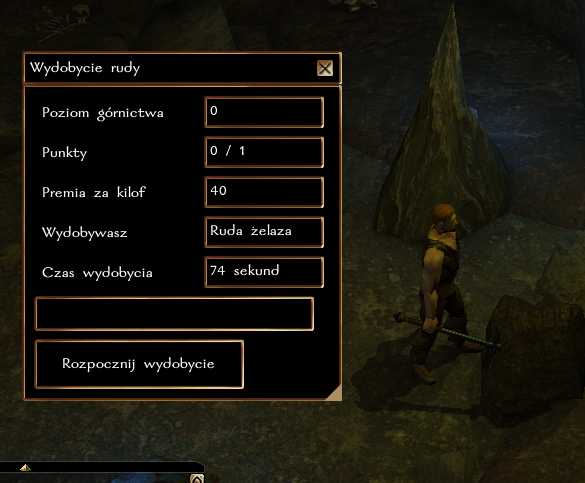
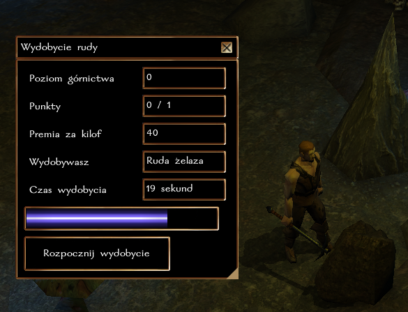

## Ogólne zasady

System górnictwa pozwala na wydobywanie rud metali (obecnie: rudy żelaza). Z rudy można wytapiać sztabki, które można sprzedawać u kowala lub wykuwać broń (obecnie tylko u NPC w Port Llast, w niedalekiej przyszłości również postacie graczy będą mogły wykuwać broń).

### Czas wydobycia

Szybkość wydobycia rudy zależy od siły postaci i jakości kilofa. Jeden cykl wydobycia trwa

``120 sekund - [3 sekundy * modyfikator Siły] - [premia za jakość kilofa]``

Przy czym minimalny czas wydobycia 1 jednostki rudy to 10 sekund.

Premia za kilof przedstawiona jest w tabeli poniżej.

| Materiał    | Mały kilof | Duży kilof |
|-------------|------------|------------|
| Zwykły/Stal | 10         | 20         |
| Adamant     | 20         | 40         |
| Mithral     | 30         | 60         |

**Przykład:** Terror Terric ma 20 siły (mod +5) i duży adamantowy kilof. Dla tej postaci czas wydobycia jednej jednostki rudy potrwa ``120 - 3 * 5 - 40``, czyli ``65 sekund``.

### Wskazówka

W grze można natrafić na specjalne kilofy [Górnika], które dodatkowo redukują czas wydobycia.

### Wydobycie rudy

Każda próba wydobycia rudy zakończona jest rzutem na górnictwo wg. następującej formuły

``k20 + poziom Górnictwa + modyfikator Siły + premia rasowa vs ST wydobycia``

- ST wydobycia dla rudy żelaza wynosi **20**
- krasnoludy posiadają modyfikator rasowy +5 do wydobycia

**Przykład:** Rurik Rand jest początkującym górnikiem (poziom rzemiosła 0), krasnoludem (+5) o sile 22 (+6). Rurik wykonuje testy Górnictwa z premią ``0 + 5 + 6``, czyli ``+11``.

### Rozwój rzemiosła

Za każde udane wydobycie jednostki rudy postać otrzymuje 1 punkt [cząstkowy] w rzemiośle. Osiągnięcie każdego nowego poziomu to także nagroda 100 + 5 * nowy poziom XP. Czyli uzyskanie 2 poziomu to 110 XP, trzeciego 115 XP, itd.

| Poziom Górnictwa | Wymagane punkty |
|------------------|-----------------|
| 2                | 1               |
| 3                | 3               |
| 4                | 6               |
| 5                | 10              |
| 6                | 15              |
| ...              | ...             |

**Obecnie maksymalny poziom górnictwa to 20.**

### Krok po kroku

