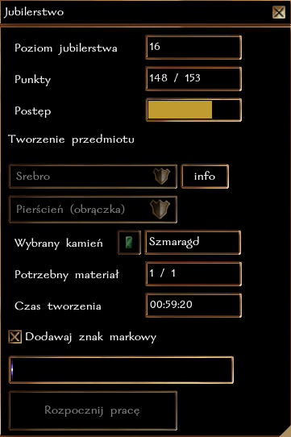

## Ogólne zasady

Jubilerstwo pozwala na:
- szlifowanie kamieni, co znacząco zwiększa ich wartość. Kamień, który można oszlifować będzie miał w nazwie (nieoszlifowany), np. Diament (nieoszlifowany). Do szlifowania kamieni niezbędne są **Narzędzia Jubilerskie**, które można oczywiście nabyć u jubilera. Jest to czynność natychmiastowa. 
- tworzenie pierścieni i amuletów w pracowni jubilerskiej. Jest to czynność czasochłonna, co oznacza, że tworzenie biżuterii może potrwać od 1 do nawet 8 godzin czasu realnego. W tym czasie postać może robić co chce, nie trzeba być nawet zalogowanym. Po upłynięciu danego czasu wystarczy wrócić do **stołu jubilerskiego**, aby sfinalizować proces tworzenia.

Postać może wytwarzać tylko jeden przedmiot w danym momencie, dotyczy to każdego rzemiosła, które jest oznaczone jako czasochłonne. Nie można więc jednocześnie np. tworzyć broni i amuletów (długie czynności).

### Szlifowanie kamieni

Aby oszlifować kamień, wystarczy użyć narzędzi na wybranym kamieniu. W menu można też wybrać docelową jakość - im wyższa jakość, tym bardziej cenny będzie kamień. Oczywiście ST wykonania rośnie wraz z jakością!

Dla każdego kamienia wykonywany jest następujący rzut

``k20 + poziom Jubilerstwa + modyfikator Zręczności + premia za jakość narzędzi vs ST szlifu``

**Przykład:** Rurik Rand jest początkującym jubilerem (poziom rzemiosła 0), o zręczności 14 (+2) i posługuje się Narzędziami Jubilerskimi +3. Rurik wykonuje testy Jubilerstwa z premią ``0 + 2 + 3``, czyli ``+5``.

### Tworzenie amuletów i pierścieni

Dostępne są 4 typy metali używanych do wytwarzania biżuterii:
- miedź
- srebro
- złoto
- mithral

Z miedzi można wykonywać jedynie zwyczajne naszyjniki i pierścienie. Pozostałe metale umożliwaiają także wykonanie przedmiotów magicznych wg. poniższych tabeli:

**Amulety**
| Metal | Amulety |
|-------------------|-----------------|
| Srebro            | Amulet Naturalnego Pancerza / Mądrości +1 |
| Złoto            | Amulet Naturalnego Pancerza / Mądrości +2 |
| Mithral            | Amulet Naturalnego Pancerza / Mądrości +3 |

**Pierścienie**
| Metal | Pierścienie |
|-------------------|-----------------|
| Srebro            | Pierścień Jasnej Myśli / Ochrony +1 |
| Złoto            | Pierścień Jasnej Myśli / Ochrony +2 |
| Mithral            | Pierścień Jasnej Myśli / Ochrony +3 |

### Przedmioty runiczne

Każdy jubiler ma szansę na wytworzenie przedmiotu z miejscami na runę. Srebrny przedmiot może mieć maksymalnie 1 runę, złoty 2, a mithralowy 3. 

Dzięki runom można stworzyć np. Amulet Odporności na Ogień, Pierścień z redukcją Obrażeń Magicznych czy po prostu zwiększyć ulepszenie przedmiotu (z +3 do maksymalnie +6 Inteligencja/Mądrość/KP). 

Szansa na 1 miejsce na runę:\
``poziom Jubilerstwa / 5 + wartość umieszczonego kamienia / 10 vs k50``

Szansa na 2 miejsca na runę:\
``poziom Jubilerstwa / 10 + wartość umieszczonego kamienia / 100 vs k50``

Szansa na 3 miejsca na runę:\
``poziom Jubilerstwa / 15 + wartość umieszczonego kamienia / 500 vs k50``

### Przedmioty z klejnotem

Aby zwiększyć wartość wytwarzanego przedmiotu, postać może zdecydować aby umieścić w nim klejnot. Im cenniejszy klejnot, tym wyższa wartość finalnego produktu. 

Umieszczenie w przedmiocie klejnotu znacznie zwiększa także szansę na stworzenie przedmiotu z miejscami na runę. 

### Znak markowy

Każdy jubiler może wybrać, aby zamieszczać swój znak markowy na wytwarzanych przedmiotach. W ten sposób, każdy będzie mógł określić pochodzenie przedmiotu.

### Rozwój rzemiosła

Za każde udane oszlifowanie kamienia postać otrzymuje 1/10 punktu, a za wykonanie przedmiotu 1 punkt [cząstkowy] w rzemiośle, (**jeżeli poziom Jubilerstwa postaci jest mniejszy niż ST oszlifowania kamienia lub jeżeli postać wykonuje przedmiot z najlepszego metalu, który umie obrabiać**). Osiągnięcie każdego nowego poziomu to także nagroda 100 + 5 * nowy poziom XP. Czyli uzyskanie 2 poziomu to 110 XP, trzeciego 115 XP, itd.

| Poziom Jubilerstwa | Wymagane punkty |
|-------------------|-----------------|
| 2                 | 1               |
| 3                 | 3               |
| 4                 | 6               |
| 5                 | 10              |
| 6                 | 15              |
| ...               | ...             |

**Obecnie maksymalny poziom Jubilerstwa to 40.**

### Krok po kroku

**Zwiększenie jakości**

**Tworzenie przedmiotów**

