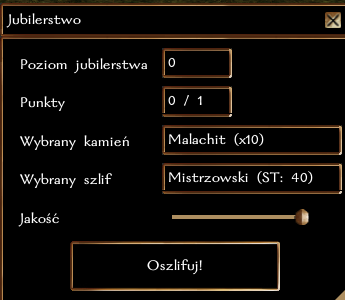
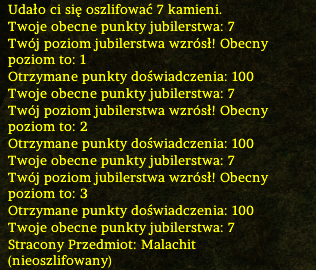
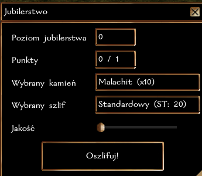

## Ogólne zasady

Obecnie, jubilerstwo pozwala na szlifowanie kamieni, co znacząco zwiększa ich wartość. Kamień, który można oszlifować będzie miał w nazwie (nieoszlifowany), np. Diament (nieoszlifowany).

Do szlifowania kamieni niezbędne są **Narzędzia Jubilerskie**, które można oczywiście nabyć u jubilera.

W przyszłości Jubilerstwo będzie także umożliwiało tworzenie pierścieni i amuletów.

### Szlifowanie kamieni

Aby oszlifować kamień, wystarczy użyć narzędzi na wybranym kamieniu. W menu można też wybrać docelową jakość - im wyższa jakość, tym bardziej cenny będzie kamień. Oczywiście ST wykonania rośnie wraz z jakością!

Dla każdego kamienia wykonywany jest następujący rzut

``k20 + poziom Jubilerstwa + modyfikator Zręczności + premia za jakość narzędzi vs ST szlifu``

**Przykład:** Rurik Rand jest początkującym jubilerem (poziom rzemiosła 0), o zręczności 14 (+2) i posługuje się Narzędziami Jubilerskimi +3. Rurik wykonuje testy Jubilerstwa z premią ``0 + 2 + 3``, czyli ``+5``.

### Rozwój rzemiosła

Za każde udane oszlifowanie kamienia postać otrzymuje 1 punkt [cząstkowy] w rzemiośle, (**jeżeli poziom Jubilerstwa postaci jest mniejszy niż ST oszlifowania kamienia**). Osiągnięcie każdego nowego poziomu to także nagroda 100 + 5 * nowy poziom XP. Czyli uzyskanie 2 poziomu to 110 XP, trzeciego 115 XP, itd.

| Poziom Jubilerstwa | Wymagane punkty |
|-------------------|-----------------|
| 2                 | 1               |
| 3                 | 3               |
| 4                 | 6               |
| 5                 | 10              |
| 6                 | 15              |
| ...               | ...             |

**Obecnie maksymalny poziom Jubilerstwa to 40.**

### Krok po kroku

**Zwiększenie jakości**

