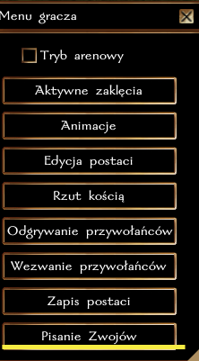
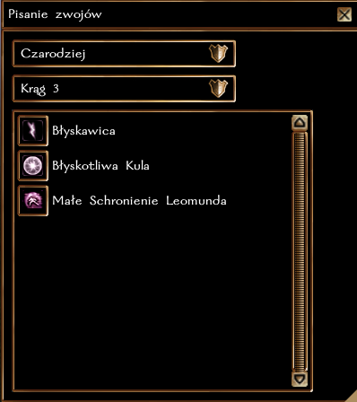
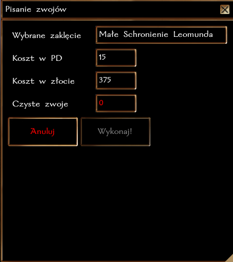

## Ogólne zasady

Pisanie Zwojów działa na serwerze na tych samych zasadach co w podstawowej grze, z drobnymi modyfikacjami wymienionymi w następnej sekcji.
(https://nwn.fandom.com/wiki/Scribe_scroll)

Oznacza to, że wymagany jest atut **Pisanie zwojów** (Czarodzieje dostają go za darmo na 1 poziomie).

### Zmiany w stosunku do pierwotnej mechaniki gry

1. Pisanie zwojów dostępne jest z Menu Gracza.
2. Postać nie musi mieć zapamiętanego czaru, wystarczy, że go zna.
3. Zapisanie zwojów Krzywdy, Prawdziwego Widzenia oraz Zatrzymania Czasu **nie wymaga** posiadania Krwi Smoka (jak w standardowej grze).
4. Zapisanie czaru Ożywienia Martwych lub Wskrzeszenia wymaga posiadania **Diamentu** (komponent materialny).
5. Zapisanie czaru Reinkarnacji wymaga **Kwiatu Orchidei** (komponent materialny).

### Wskazówki

Czyste zwoje można zakupić w Neverwinter, w **Skrytowieży** oraz w większości świątyń (nie mylić ze zwykłym pergaminem do zapisywania notatek).

### Krok po kroku
**1.**

**2.**

**3.**

