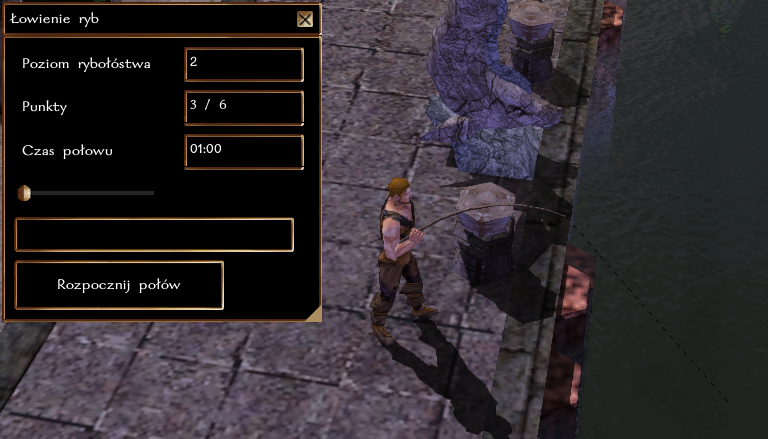
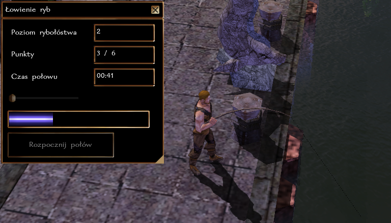
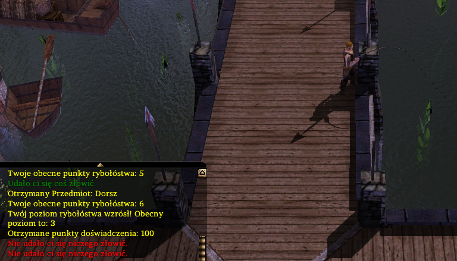
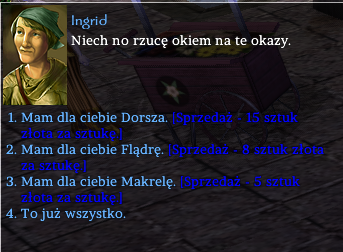

## Ogólne zasady

System pozwala na łowienie ryb za pomocą wędki (można ją nabyć m.in. u Ingrid na targu w Port Llast). Umożliwia on na wyłowienie ryby, a czasem nawet kraba lub ostrygi (koniecznie sprawdź czy nie zawiera perły!). Jeśli masz wyjątkowe szczęście, możesz natrafić nawet na wiadomość w butelce.

### Połów

Połów może trwać od 1 do 10 minut (czas jest do określenia przy pomocy suwaka). Przez ten czas postać musi pozostawać w tym samym miejscu i nie wykonywać żadnych innych czynności. Za każdą minutę spędzoną na łowieniu ryb, postaci przysługuje rzut wg. następującego wzoru:

``k100 + poziom Łowienia ryb + modyfikator Zręczności vs ST 66``

### Rozwój rzemiosła

Za każdy udany połów postać otrzymuje 1 punkt [cząstkowy] w rzemiośle. Osiągnięcie każdego nowego poziomu to także +100 XP.

| Poziom Łowienia ryb | Wymagane punkty |
|-------------------|-----------------|
| 2                 | 1               |
| 3                 | 3               |
| 4                 | 6               |
| 5                 | 10              |
| 6                 | 15              |
| ...               | ...             |

**Obecnie maksymalny poziom łowienia ryb to 40.**

### Krok po kroku

