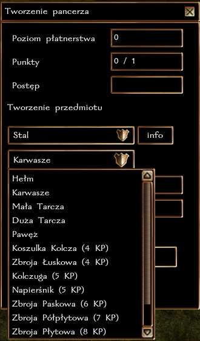

## Ogólne zasady

Płatnerstwo pozwala na wykuwanie zbroi (koszulka kolcza lub cięższe), karwaszów i hełmów z metalowych sztabek. Obecnie w grze występują 3 typy metali, które są używane do rzemiosła: stan, adamant i mithral. Przy pomocy kowadła i lekkiego młota, postać może wykuć przedmiot.

**Każda próba wykucia zbroi kończy się sukcesem**, a im wyższy poziom rzemiosła tym potężniejszą zbroję można stworzyć.

**Maksymalne ulepszenie, które można uzyskać to +6** (Mithralowa zbroja z 3 slotami na runę + 3 Runy Mocy). Dotyczy to zarówno KP, jak i Karwaszów Siły.

### Typ rzemiosła i działanie z innymi systemami

Płatnerstwo jest rzemiosłem **czasochłonnym**, co oznacza, że wykuwanie zbroi może potrwać od 1 do nawet 4 godzin czasu realnego. W tym czasie postać może robić co chce, nie trzeba być nawet zalogowanym. Po upłynięciu danego czasu wystarczy wrócić do Kowadła, aby sfinalizować proces tworzenia.

Postać może wytwarzać tylko jeden przedmiot w danym momencie, dotyczy to każdego rzemiosła, które jest oznaczone jako czasochłonne. Czyli można "jednocześnie" wykuwać broń i szlifować kamienie/wytapiać sztaby (czynności natychmiastowe), a nawet łowić ryby lub kopać rudę (krótka czynność). Nie można jednak tworzyć broni i pancerza jednocześnie (długie czynności).

### Poziomy wtajemniczenia

Nowicjusze w rzemiośle nie znają tajników pracy ze specjalnymi metalami. Aby tworzyć zbroję adamantową potrzeba przynajmniej 7 poziomu płatnerstwa. Mithralowa zbroja wymaga aż 9 poziomu.

### Specjalne właściwości

**Hełmy**

| Typ hełmu  | Premia                                |
|------------|---------------------------------------|
| Stalowy    | +1 KP, redukcja obrażeń fizycznych 3% |
| Adamantowy | +2 KP, redukcja obrażeń fizycznych 6% |
| Mithralowy | +3 KP, redukcja obrażeń fizycznych 9% |

**Karwasze**

| Typ karwaszy  | Premia  |
|------------|---------|
| Stalowe    | +1 Siła |
| Adamantowe | +2 Siła |
| Mithralowe | +3 Siła |

**Zbroje**

| Typ zbroji  | Premia                                                                              |
|------------|-------------------------------------------------------------------------------------|
| Stalowa    | +1 KP                                                                               |
| Adamantowa | +2 KP, redukcja obrażeń 5/+1                                                        |
| Mithralowa | +3 KP, zmniejszony ciężar (80%), zmniejszone ryzyko niepowodzenia zaklęcia (15-30%) |

### Zbroja runiczna

Każdy kowal ma szansę na wytworzenie zbroi (dotyczy również hełmu oraz karwaszów) z miejscami na runę. Stalowa zbroja może mieć maksymalnie 1 runę, adamantowa 2, a mithralowa 3.

Szansa na 1 miejsce na runę:

``poziom Płatnerstwa + poziom w klasie wojownika vs k50``

Szansa na 2 miejsca na runę:

``poziom Płatnerstwa/2 + poziom w klasie wojownika/2 vs k50``

Szansa na 3 miejsca na runę:

``poziom Płatnerstwa/5 + poziom w klasie wojownika/5 vs k50``

### Znak markowy

Każdy kowal może wybrać, aby zamieszczać swój znak markowy na wytwarzanych przedmiotach. W ten sposób, każdy będzie mógł określić pochodzenie przedmiotu.

### Rozwój rzemiosła

Za każde udane wytworzenie przedmiotu postać otrzymuje 1 punkt [cząstkowy] w rzemiośle. Osiągnięcie każdego nowego poziomu to także nagroda 100 + 5 * nowy poziom XP. Czyli uzyskanie 2 poziomu to 110 XP, trzeciego 115 XP, itd.

| Poziom Płatnerstwa | Wymagane punkty |
|--------------------|-----------------|
| 2                  | 1               |
| 3                  | 3               |
| 4                  | 6               |
| 5                  | 10              |
| 6                  | 15              |
| ...                | ...             |

### Krok po kroku

