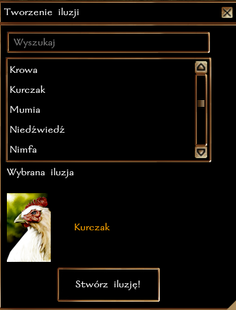

# Czary przywołujące iluzoryczne stworzenia

Czary iluzji mogą stworzyć realnie wyglądające obrazy stworzeń: 

- Niemy Obraz [Bard/Czarodziej/Czarownik I]: iluzja malutkiego lub małego stworzenia (np. borsuk, goblin)
- Mniejszy Obraz [Bard/Czarodziej/Czarownik II]: jak Niemy Obraz + średniego rozmiaru istoty (np. driada, jaszczuroczłek)
- Większy Obraz [Bard/Czarodziej/Czarownik III]: jak Mniejszy Obraz + duże istoty (np. olbrzym, żelazny golem)
- Trwały Obraz [Bard/Czarodziej/Czarownik VI]: (obecnie) jak Większy Obraz

Iluzja, która zostanie zaatakowana lub stanie się celem Rozproszenia Magii znika. 

# Tworzenie Iluzji

Podczas rzucania czaru z kategorii iluzji można wybrać pożądany efekt z menu. 

# Rozpoznanie Iluzji

Iluzję można rozpoznać na dwa sposoby:
- Niedowierzanie (Rzut na Siłę Woli): rzut obronny przeciwko iluzji wykonywany jest w momencie sprawdzania stworzenia opcją "Zbadaj" (oko).
- Prawdziwe Widzenie: postać, która jest pod wpływem czaru Prawdziwe Widzenie automatycznie rozpoznaje iluzję w momencie sprawdzania stworzenia opcją "Zbadaj" (oko).

Jeśli iluzja została rozpoznana, informacja o tym pojawi się w opisie, a wyświetlane imię stworzenia zostanie zmienione na "Iluzja". 