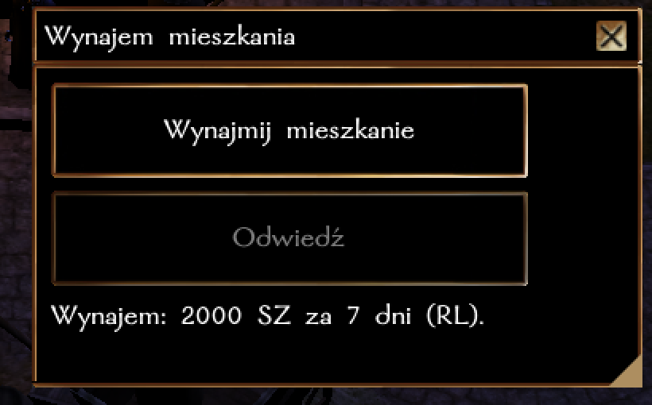

# Mieszkania na wynajem

Po co wynajmować pokój w gospodzie, kiedy można wynająć wygodny apartament? Mieszkania na wynajem znajdują się obecnie w następujących lokacjach: 
- Miasto Neverwinter: Centrum
- Miasto Neverwinter: Doki
- Miasto Luskan: Strona Północna

## Jak funkcjonuje wynajem?

Po kilknięciu na drzwi uznaczone na mapie jako "Mieszkanie na wynajem", otwiera się okno dialogowe z cennikiem. Wystarczy że postać posiada daną kwotę przy sobie. 
Okres najmu to 1 tydzień czasu rzeczywistego, po upłynięciu tego okresu trzeba dokonać wpłaty ponownie. 

Gdy mieszkanie jest już opłacone, można przejść do mieszkania. Możliwe jest take odiwedzanie postaci, które należą do naszej drużyny. 

## Często zadawane pytania

1. Czy można wynająć wspólne mieszkanie dla dwóch/kilku postaci? 

NIE. Można odgrywać "wspólne" mieszkanie, ale w takim wypadku obie postacie po prostu muszą mieć wynajęty lokal w tym samym miejscu (i korzystać z opcji "Odwiedź").

2. Czy można mieć więcej niż jedno mieszkanie?

NIE. Możliwa jest "przeprowadzka" z jednego miejsca w drugie, jeśli postać ma taką chęć, ale można posiadać maksymalnie jedno mieszkanie w danym momencie. 

3. Czy można się włamać do mieszkania innego gracza?

Obecnie NIE, ale system będzie rozbudowany o dodatkowe opcje, aby umożliwić np. podsłuchiwanie/śledzenie postaci, które poszły porozmawiać do mieszkania. 

4. Co się stanie jeśli nie przedłużę wynajmu na czas? 

Nic, jeśli ktoś będzie np. 2 tygodnie na wakacjach, wystarczy że opłaci mieszkanie po powrocie (technicznie jest to po prostu nowy najem). Nie trzeba przedłużać wynajmu. 

5. Czy mogę zorganizować meble/wygląd mieszkania wedle swojego projektu?

NIE. System będzie rozbudowany o możliwość wprowadzenia drobnych modyfikacji (np. powieszenie obrazu), ale mieszkanie wedle własnego projektu wymaga zakupu własnej lokacji. 