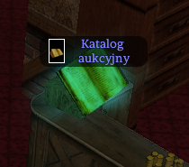
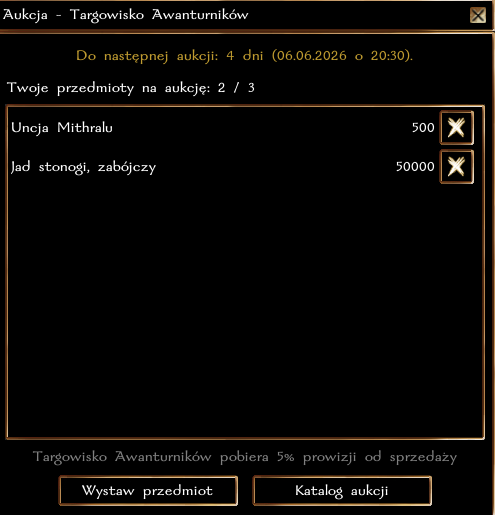
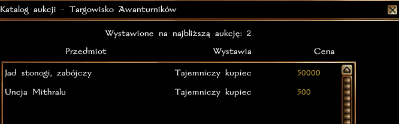
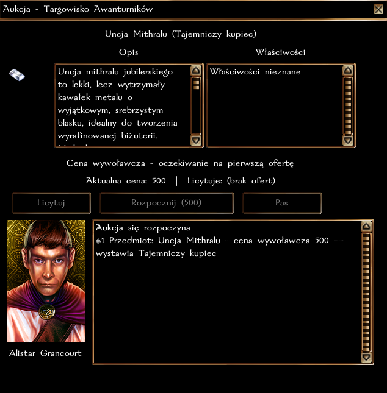
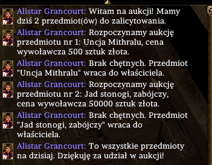
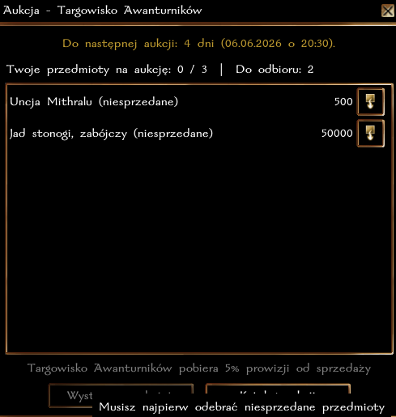

# Aukcja

Co dwa tygodnie, w sobotę o 20:30, odbywa się aukcja przedmiotów na Targowisku Awanturników. Prowadzi ją Alistar. Dostęp do menu aukcji możliwy przez Katalog Aukcyjny.

## Wystawianie przedmiotów

Każda postać może wystawić maksymalnie 3 przedmioty. Dozwolone jest wystawianie przedmiotów przez kilka postaci gracza, ale nie można w ten sposób handlować pomiędzy własnymi postaciami (aby temu zapobiec, system posiada stosowne zabezpieczenia).

Lista przedmiotów wystawionych na licytację jest dostępna przez Katalog, ale ich właściwości można podejrzeć dopiero podczas licytacji. MG mają możliwość dodawania specjalnych przedmiotów na aukcję jako "Tajemniczy Kupiec". 

## Przebieg aukcji

Licytacja następuje o określonej porze, a menu aukcji otwiera się przez kliknięcie na Katalog. 

## Zakończenie aukcji

Po aukcji niesprzedane przedmioty trafiają z powrotem do właścicieli. 
