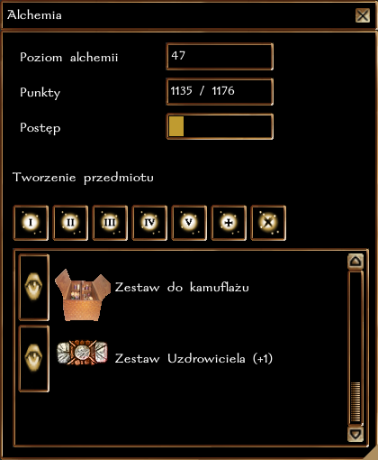
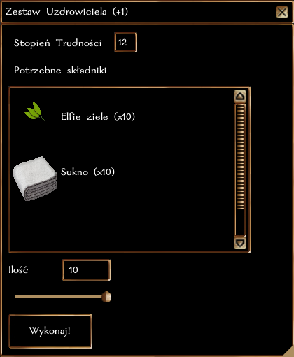

###### Pokrewne tematy: [Zbieranie ziół](https://wiki.nwn.net.pl/docs/Systemy%20Autorskie/Zbieranie%20ziol), [Wyroby alchemiczne](https://wiki.nwn.net.pl/docs/Przedmioty/Wyroby%20alchemiczne), [Przedmioty runiczne](https://wiki.nwn.net.pl/docs/Przedmioty/Przedmioty%20runiczne)

## Ogólne zasady

Alchemia pozwala na wytwarzanie mikstur oraz innych wyrobów alchemicznych. Podstawowe składniki do alchemii można kupić w sklepie, inne można zebrać (zioła), zdobyć z potwora (np. krew trolla) lub po prostu znaleźć w skrzyniach ze skarbami (np. rtęć).

Podczas każdej próby wykonania przedmiotu postać wykonuje test na rzemiosło. Nieudana próba oznacza utratę składników.

### Typ rzemiosła i działanie z innymi systemami

Alchemia jest rzemiosłem natychmiastowym, co oznacza, że wytwarzanie mikstur trwa zaledwie kilka sekund czasu realnego. Jest to w oczywisty sposób ułatwienie rozgrywki i nie odzwierciedla fabularnej strony procesu alchemicznego.

Wytwarzanie mikstur nie koliduje z systemami czasochłonnymi, takimi jak Kowalstwo czy Płatnerstwo.

### Grupy wyrobów

Wyroby alchemiczne dzielą się na kilka grup. I - IV to głównie mikstury, a V grupa to runy ulepszające przedmioty. Początkowo postać zna jedynie grupy I i II, a wykonywania wyrobów z wyższych uczy się z Recept. Większość Recept jest dostępna do kupienia u Alchemika, pozostałe można znaleźć w tubach ze zwojami lub dostać w nagrodę za wykonanie zadania od NPC.

Istnieją jeszcze dwie osobne gałęzie alchemii: Wyroby Specjalne i Trucizny.

**Wyroby Specjalne** to unikalne recepty, które mogą być odblokowane jedynie poprzez wybranie specjalnej klasy prestiżowej (np. Harfiarz) lub atutu (Warzenie Mikstur).

### Specjalne premie

Atut **Warzenie Mikstur** zapewnia premię +5 do rzutów na Alchemię, odblokowuje wszystkie wyroby grup III-IV oraz następujące Wyroby Specjalne:

- Bomba Kwasowa
- Bomba Ogniowa
- Zestaw Uzdrowiciela +10.

### Proces Alchemiczny

Przy każdej próbie stworzenia przedmiotu, wykonuje się rzut wg. następującej formuły

``k20 + poziom Alchemii + modyfikator Inteligencji + premia za atut Warzenie Mikstur vs ST mikstury/runy``

### Rozwój rzemiosła

Za każde wytworzenie mikstury postać otrzymuje 1 punkt [cząstkowy] w rzemiośle. Osiągnięcie każdego nowego poziomu to także nagroda 100 + 5 * nowy poziom XP. Czyli uzyskanie 2 poziomu to 110 XP, trzeciego 115 XP, itd.

| Poziom Alchemii | Wymagane punkty |
|-----------------|-----------------|
| 2               | 1               |
| 3               | 3               |
| 4               | 6               |
| 5               | 10              |
| 6               | 15              |
| ...             | ...             |

### Krok po kroku
Kliknij na **nazwę** przedmiotu, by zacząć wytwarzanie.

\

## Spis wyrobów alchemicznych

### Grupa I
| Nazwa Wyrobu         | Składniki                            |
|----------------------|--------------------------------------|
| Mikstura Leczenia Lekkich Ran | butelka, woda, krwawnik, elfie ziele |
| Mikstura Korowej Skóry        | butelka, woda, kora dębu, bagienne ziele |
| Woda Święcona (kapłani) | woda, jemioła |
| Mikstura Żelaznego Żołądka | butelka, woda, liść mięty, słońce Neverwinter |
| Maść Kauczukowa | słoik, smalec, gałąź kauczukowca |
| Maść Lecznicza | słoik, smalec, elfie ziele, pokrzywa |
| Zestaw do kamuflażu | sakiewka, popiół, kora dębu, tatarak |
| Zestaw Uzdrowiciela (+1) | sukno, elfie ziele |

### Grupa II
| Nazwa Wyrobu         | Składniki                            |
|----------------------|--------------------------------------|
| Mikstura Leczenia Średnich Ran | butelka, woda, krwawnik, elfie ziele |
| Worek Pętlinogi | sakiewka, lina, gałąź kauczukowca |
| Duszący Pył | sakiewka, popiół, powój, trujący bluszcz |
| Mikstura Błogosławieństwa | woda święcona, aloes |
| Kamień Gromu | tabliczka runiczna, opiłki metalu |
| Ogień Alchemiczny | słoik, siarka, spirytus |
| Mikstura Oddychania Pod Wodą | butelka, woda, ziarno gorczycy, rybie skrzela, liść kelanu |

### Grupa III
| Nazwa Wyrobu         | Składniki                            |
|----------------------|--------------------------------------|
| Mikstura Leczenia Poważnych Ran  | butelka, woda, krwawnik, skrzyp, elfie ziele |
| Mikstura Siły | butelka, woda, spirytus, ząb wilka, grzybki Velt |
| Mikstura Zręczności | butelka, woda, spirytus, pazur pantery, grzybki Velt |
| Mikstura Kondycji | butelka, woda, spirytus (???), kieł dzika, grzybki Velt |
| Mikstura Intelektu | butelka, woda, kwiat rozmarynu, ogon myszy |
| Mikstura Rozsądku | butelka, woda, pióro sowy, orzech Rout |
| Mikstura Majestatu | butelka, woda, pióro orła, kwiat Orchidei |
| Mikstura Pomocy | butelka, woda, imbir, liść kelanu |
| Mikstura Niewidzialności | butelka, woda, pyłek fey, kora dębu |
| Zestaw Uzdrowiciela (+3) | sukno, spirytus, elfie ziele |

### Grupa IV
| Nazwa Wyrobu         | Składniki                            |
|----------------------|--------------------------------------|
| Mikstura Widzenia | butelka, woda, widłak, orzech Rout |
| Mikstura Szybkości | butelka, woda, spirytus, żywotnik, grzybki Velt |
| Mikstura Mniejszego Przywrócenia | butelka, woda, pięciornik, elfie ziele |
| Napar Trolla | butelka, woda, krew trolla, krwawnik, pokrzywa |
| Antidotum | butelka, woda, ostopest, liść kelanu, liść mięty |
| Mentat | butelka, woda, tatarak, melisa, aloes |
| Księżycowy Pył | sakiewka, żywotnik, mąka, imbir, diament |

### Grupa V - Runy
| Nazwa Runy           | Składniki                            |
|----------------------|--------------------------------------|
| Mocy | tabliczka runiczna, rubin, uncja złota |
| Ognia | tabliczka runiczna, ognisty opal, ogień alchemiczny |
| Mrozu | tabliczka runiczna, perła, szafir, zimny kamień |
| Ziemi | tabliczka runiczna, węgiel, szmaragd, uncja mithralu |
| Błyskawicy | tabliczka runiczna, szafir, topaz, pióro orła |
| Cienia | tabliczka runiczna, cienisty klejnot, pył |
| Trucizny | tabliczka runiczna, szmaragd, rtęć, butelka kwasu |
| Magii | tabliczka runiczna, szafir, uncja mithralu, pióro sowy |
| Czaszki | tabliczka runiczna, diament, węgiel, ząb wilka |
| Błogosławieństwa | tabliczka runiczna, topaz, diament, woda święcona |
| Wampira | tabliczka runiczna, rtęć, rubin, kieł wampira |

### Grupa VI - Wyroby Specjalne
| Nazwa Wyrobu         | Składniki                            |
|----------------------|--------------------------------------|
| Biała Wróżka | butelka, spirytus, powój, melisa |
| Bomba kwasowa | słoik, kwas, ogień alchemiczny, siarka |
| Bomba ogniowa | słoik, węgiel, Ogień alchemiczny, siarka |
| Flakon Życia | butelka, diament, woda święcona, kwiat orchidei |
| Mikstura Oddechu Smoka | butelka, spirytus, siarka, fiolka jadu wiwerny |
| Zestaw Uzdrowiciela +10 | sukno, spirytus, elfie ziele |
| Mikstura Słonecznej Opończy | butelka, topaz, Słońce Neverwinter, woda święcona |

### Grupa VII - Trucizny
| Nazwa Trucizny       | Składniki                            |
|----------------------|--------------------------------------|
| Pył Ungol | sakiewka, ruda ungol |
| Olej Taggit | butelka, grzybki Taggit, orzech Rout |
| Korzeń Teranivu | butelka, korzeń Teranivu, spirytus alchemiczny |
| Jad Wielkiego Pająka | fiolka jadu wielkiego pająka |
| Podmuch Zimy | słoik, smalec, zimny kamień |
| Jad Ogromnej Osy | fiolka jadu ogromnej osy |
| Jad Ogromnego Skorpiona | fiolka jadu ogromnego skorpiona |
