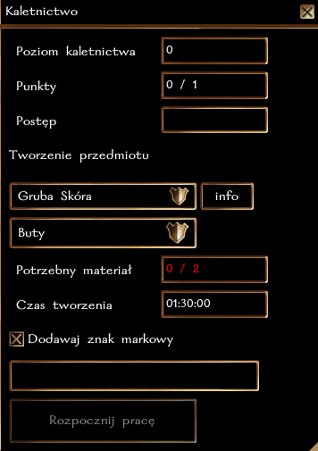

## Ogólne zasady

Kaletnictwo pozwala na wytwarzanie różnych typów wyrobów ze skóry: lekkich zbroi, butów, pasów, proc, rękwic ćwiekowanych i toreb. Obecnie w grze występują 3 typy skór, które są używane do rzemiosła: zwykła gruba skóra, skóra Monstrualnego Niedźwiedzia i skóra Wiwerny. Przy pomocy pracowni kaletnika, postać może stworzyć przedmiot.

**Każda próba stworzenia przedmiotu kończy się sukcesem**, a im wyższy poziom rzemiosła tym potężniejszy przedmiot można stworzyć.

**Maksymalne ulepszenie, które można uzyskać to +6** (Zbroja ze Skóry Wiwerny z 3 slotami na runę + 3 Runy Mocy). Dotyczy to zarówno KP, jak i Pasów [Kondycja], Butów [KP] i Rękawic [premia za ulepszenie].

### Typ rzemiosła i działanie z innymi systemami

Kaletnictwo jest rzemiosłem **czasochłonnym**, co oznacza, że tworzenie przedmiotu może potrwać od 1 do nawet 2 godzin czasu realnego. W tym czasie postać może robić co chce, nie trzeba być nawet zalogowanym. Po upłynięciu danego czasu wystarczy wrócić do pracowni kaletnika, aby sfinalizować proces tworzenia.

Postać może wytwarzać tylko jeden przedmiot w danym momencie, dotyczy to każdego rzemiosła, które jest oznaczone jako czasochłonne. Czyli można "jednocześnie" szyć płaszcze i szlifować kamienie/wytapiać sztaby (czynności natychmiastowe), a nawet łowić ryby lub kopać rudę (krótka czynność). Nie można jednak tworzyć broni i szyć jednocześnie (długie czynności).

### Poziomy wtajemniczenia

Nowicjusze w rzemiośle nie znają tajników pracy ze specjalnymi materiałami. Aby tworzyć przedmiot ze skóry Monstrualnego Niedźwiedzia potrzeba przynajmniej 7 poziomu kaletnictwa. Przedmioty ze skóry Wiwerny wymagają aż 9 poziomu.

### Specjalne właściwości

**Zbroje skórzane**

| Typ zbroi            | Premia |
|----------------------|--------|
| Zwykła (z dobrej jakości skóry) | +1 KP  |
| Ze skóry Monstrualnego Niedźwiedzia | +2 KP, Redukcja obrażeń 5/+1  |
| Ze skóry Wiwerny | +3 KP, zmniejszony ciężar (80%), zmniejszone ryzyko niepowodzenia zaklęcia (15-30%)  |

**Buty**

| Typ butow            | Premia       |
|----------------------|--------------|
| Dobre                | +1 KP |
| Piękne               | +2 KP |
| Wspaniałe            | +3 KP |

**Pasy**

| Typ pasa             | Premia     |
|----------------------|------------|
| Dobry                | +1 Kondycja |
| Piękny               | +2 Kondycja |
| Wspaniały            | +3 Kondycja |

**Proce**

| Typ procy         | Premia      |
|----------------------|-------------|
| Dobra proca                | premia +1 do ataku, potężny 2|
| Proca z garbowanej skóry      | premia +2 do ataku, potężny 4 |
| Proca ze skóry wiwerny | premia +3 do ataku, potężny 6 |

**Rękawice ćwiekowane**

| Typ rękawic             | Premia     |
|----------------------|------------|
| Dobre                | premia za ulepszenie +1, premia do obrażeń (kłute) |
| Piękne               | premia za ulepszenie +2, premia do obrażeń (kłute)|
| Wspaniałe            | premia za ulepszenie +3, premia do obrażeń (kłute) |

Premia do obrażeń ustalana jest według poniższej tabeli. 

| Poziom kaletnictwa | Premia |
|------------------|--------|
| 0                | 1k4    |
| 5                | 1k6    |
| 10               | 1k8    |
| 15               | 1k10   |
| 20               | 1k12   |
| 25               | 2k6    |
| 30               | 2k8    |
| 35               | 2k10   |
| 40               | 2k12   |

**Torby**

| Typ torby             | Premia     |
|----------------------|------------|
| Zwykla                | brak |
| Magiczna sakiewka (skóra monstrualnego niedźwiedzia)              | zmniejszenie ciężaru -20% |
| Mniejsza Magiczna Torba (skóra wiwerny)            | zmniejszenie ciężaru -40% |

### Przedmioty runiczne

Każdy kaletnik ma szansę na wytworzenie przedmiotu z miejscami na runę. Zwykły przedmiot może mieć maksymalnie 1 runę, ze skóry niedźwiedzia 2, a ze skóry wiwerny 3.

Szansa na 1 miejsce na runę:\
``poziom Kaletnictwa + poziomy w klasie barbarzyńcy, druida i łowcy vs k50``

Szansa na 2 miejsca na runę:\
``poziom Kaletnictwa/2 + poziomy w klasie barbarzyńcy, druida i łowcy/2 vs k50``

Szansa na 3 miejsca na runę:\
``poziom Kaletnictwa/5 + poziomy w klasie barbarzyńcy, druida i łowcy/5 vs k50``

### Znak markowy

Każdy kaletnik może wybrać, aby zamieszczać swój znak markowy na wytwarzanych przedmiotach. W ten sposób, każdy będzie mógł określić pochodzenie przedmiotu.

### Rozwój rzemiosła

Za każde udane wytworzenie przedmiotu postać otrzymuje 1 punkt [cząstkowy] w rzemiośle. Osiągnięcie każdego nowego poziomu to także nagroda 100 + 5 * nowy poziom XP. Czyli uzyskanie 2 poziomu to 110 XP, trzeciego 115 XP, itd.

| Poziom Kaletnictwa | Wymagane punkty |
|-------------------|-----------------|
| 2                 | 1               |
| 3                 | 3               |
| 4                 | 6               |
| 5                 | 10              |
| 6                 | 15              |
| ...               | ...             |

### Krok po kroku

