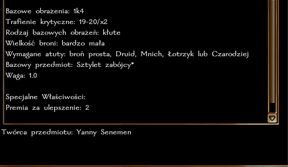
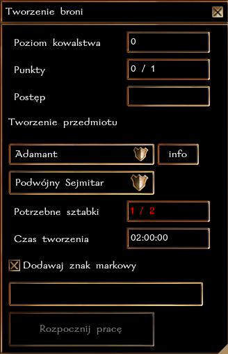

## Ogólne zasady

Kowalstwo pozwala na wykuwanie broni z metalowych sztabek. Obecnie w grze występują 3 typy metali, które są używane do rzemiosła: stan, adamant i mithral. Przy pomocy kowadła i lekkiego młota, postać może wykuć niemal dowolną broń.

**Każda próba wykucia broni kończy się sukcesem**, a im wyższy poziom rzemiosła tym potężniejszą broń można stworzyć.

### Typ rzemiosła i działanie z innymi systemami

Kowalstwo jest rzemiosłem **czasochłonnym**, co oznacza, że wykuwanie broni może potrwać od 1 do nawet 2 godzin czasu realnego. W tym czasie postać może robić co chce, nie trzeba być nawet zalogowanym. Po upłynięciu danego czasu wystarczy wrócić do Kowadła, aby sfinalizować proces tworzenia.

Postać może wytwarzać tylko jeden przedmiot w danym momencie, dotyczy to każdego rzemiosła, które jest oznaczone jako czasochłonne. Czyli można "jednocześnie" wykuwać broń i szlifować kamienie/wytapiać sztaby (czynności natychmiastowe), a nawet łowić ryby lub kopać rudę (krótka czynność). Nie można jednak tworzyć broni i pancerza jednocześnie (długie czynności).

### Poziomy wtajemniczenia

Nowicjusze w rzemiośle nie znają tajników pracy ze specjalnymi metalami. Aby tworzyć broń adamantową potrzeba przynajmniej 7 poziomu kowalstwa. Mithralowa broń wymaga aż 9 poziomu.

### Specjalne właściwości

| Typ broni  | Premia  |
|------------|---------|
| Stalowa    | +1 Ulepszenie |
| Adamantowa | +2 Ulepszenie |
| Mithralowa | +3 Ulepszenie |

### Dodatkowe premie

Każdy kowal posiada zawsze **5% szans na wytworzenie broni z Ostrością**.

Dodatkowo, każdy kowal posiada zawsze **5% szans na wytworzenie broni z Potężnym Trafieniem Krytycznym**. Potencjalnie istnieje możliwość stworzenia broni z Ostrością i PTK. Moc PTK określa poniższa tabela.

| Poziom kowalstwa | Premia |
|------------------|--------|
| 0                | 1k4    |
| 5                | 1k6    |
| 10               | 1k8    |
| 15               | 1k10   |
| 20               | 1k12   |
| 25               | 2k6    |
| 30               | 2k8    |
| 35               | 2k10   |
| 40               | 2k12   |

### Broń runiczna

Każdy kowal ma szansę na wytworzenie broni z miejscami na runę. Stalowa broń może mieć maksymalnie 1 runę, adamantowa 2, a mithralowa 3.

Szansa na 1 miejsce na runę:
``poziom Kowalstwa + poziom w klasie wojownika vs k50``

Szansa na 2 miejsca na runę:
``poziom Kowalstwa/2 + poziom w klasie wojownika/2 vs k50``

Szansa na 3 miejsca na runę:
``poziom Kowalstwa/5 + poziom w klasie wojownika/5 vs k50``

### Znak markowy

Każdy kowal może wybrać, aby zamieszczać swój znak markowy na wytwarzanych przedmiotach. W ten sposób, każdy będzie mógł określić pochodzenie przedmiotu.

### Rozwój rzemiosła

Za każde wytworzenie broni postać otrzymuje 1 punkt [cząstkowy] w rzemiośle. Osiągnięcie każdego nowego poziomu to także nagroda 100 + 5 * nowy poziom XP. Czyli uzyskanie 2 poziomu to 110 XP, trzeciego 115 XP, itd.

| Poziom Kowalstwa | Wymagane punkty |
|------------------|-----------------|
| 2                | 1               |
| 3                | 3               |
| 4                | 6               |
| 5                | 10              |
| 6                | 15              |
| ...              | ...             |

### Przykładowe właściwości

Jakie właściwości ostatecznie otrzyma broń wykuta przez twoją postać? Jest to suma kilku czynników:

- Premia za Ulepszenie (+1/2/3) w zaleności od zastosowanego materiału
- Dodatkowo, zawsze 5% szans na ostrość, 5% szans na PTK
- Dodatkowo, zawsze jest szansa na stworzenie broni z runą.

Czyli ostatecznie, w najlepszym wypadku możesz stworzyć, np. Mithralowy Długi Miecz +3, Ostrość, PTK 2k12, z 3 miejscami na runę.
Taki przedmiot nie posiada innych specjalnych właściwości, takich jak np. premia do obrażeń. Można je dodać później przy pomocy [run](../09-Przedmioty//03-Przedmioty%20runiczne.md).

### Krok po kroku

