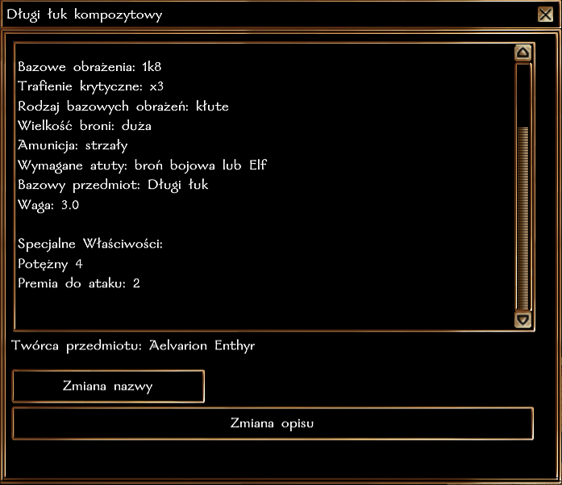
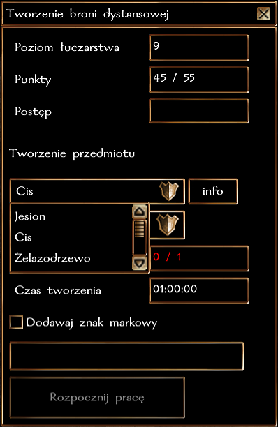

## Ogólne zasady

Łuczarstwo pozwala na wytwarzanie broni dystansowych z drewna. Obecnie w grze występują 3 typy drewna, które są używane do rzemiosła: jesion, cis i żelazodrzewo (zdobywane przy pomocy [Drwalnictwa](https://wiki.nwn.net.pl/docs/Systemy%20Rzemios%C5%82a/Drwalnictwo)). Przy pomocy stanowiska łuczarskiego, postać może wytworzyć kusze i łuki.

**Każda próba wytworzenia broni kończy się sukcesem**, a im wyższy poziom rzemiosła tym potężniejszą broń można stworzyć.

### Typ rzemiosła i działanie z innymi systemami

Łuczarstwo jest rzemiosłem **czasochłonnym**, co oznacza, że wytwarzanie broni może potrwać od 1 do nawet 2 godzin czasu realnego. W tym czasie postać może robić co chce, nie trzeba być nawet zalogowanym. Po upłynięciu danego czasu wystarczy wrócić do stanowiska, aby sfinalizować proces tworzenia.

Postać może wytwarzać tylko jeden przedmiot w danym momencie, dotyczy to każdego rzemiosła, które jest oznaczone jako czasochłonne. Czyli można "jednocześnie" wytwarzać broń i szlifować kamienie/wytapiać sztaby (czynności natychmiastowe), a nawet łowić ryby lub kopać rudę (krótka czynność). Nie można jednak tworzyć broni i pancerza jednocześnie (długie czynności).

### Poziomy wtajemniczenia

Nowicjusze w rzemiośle nie znają tajników pracy ze specjalnym drewnem. Aby tworzyć broń cisową potrzeba przynajmniej 7 poziomu łuczarstwa. Broń z żelazodrzewa wymaga aż 9 poziomu.

### Specjalne właściwości

| Typ broni     | Premia  |
|---------------|---------|
| Jesionowa     | +1 Ulepszenie |
| Cisowa        | +2 Ulepszenie |
| Żelazodrzewna | +3 Ulepszenie |

### Dodatkowe premie

Każdy łuczarz posiada zawsze **5% szans na wytworzenie broni z Ostrością**.

Dodatkowo, każdy łuczarz posiada zawsze **5% szans na wytworzenie broni z Potężnym Trafieniem Krytycznym**. Potencjalnie istnieje możliwość stworzenia broni z Ostrością i PTK. Moc PTK określa poniższa tabela.

| Poziom łuczarstwa | Premia |
|-------------------|--------|
| 0                 | 1k4    |
| 5                 | 1k6    |
| 10                | 1k8    |
| 15                | 1k10   |
| 20                | 1k12   |
| 25                | 2k6    |
| 30                | 2k8    |
| 35                | 2k10   |
| 40                | 2k12   |

### Broń runiczna

Każdy łuczarz ma szansę na wytworzenie broni z miejscami na runę. Jesionowa broń może mieć maksymalnie 1 runę, cisowa 2, a z żelazodrzewa 3.

Szansa na 1 miejsce na runę:
``poziom Łuczarstwa + poziom w klasie łowcy vs k50``

Szansa na 2 miejsca na runę:
``poziom Łuczarstwa/2 + poziom w klasie łowcy/2 vs k50``

Szansa na 3 miejsca na runę:
``poziom Łuczarstwa/5 + poziom w klasie łowcy/5 vs k50``

### Znak markowy

Każdy łuczarz może wybrać, aby zamieszczać swój znak markowy na wytwarzanych przedmiotach. W ten sposób, każdy będzie mógł określić pochodzenie przedmiotu.

### Rozwój rzemiosła

Za każde wytworzenie broni postać otrzymuje 1 punkt [cząstkowy] w rzemiośle. Osiągnięcie każdego nowego poziomu to także nagroda 100 + 5 * nowy poziom XP. Czyli uzyskanie 2 poziomu to 110 XP, trzeciego 115 XP, itd.

| Poziom Łuczarstwa | Wymagane punkty |
|-------------------|-----------------|
| 2                 | 1               |
| 3                 | 3               |
| 4                 | 6               |
| 5                 | 10              |
| 6                 | 15              |
| ...               | ...             |

### Przykładowe właściwości

Jakie właściwości ostatecznie otrzyma broń wytworzona przez twoją postać? Jest to suma kilku czynników:

- Premia za Ulepszenie (+1/2/3) w zaleności od zastosowanego materiału
- Dodatkowo, zawsze 5% szans na ostrość, 5% szans na PTK
- Dodatkowo, zawsze jest szansa na stworzenie broni z runą

Czyli ostatecznie, w najlepszym wypadku możesz stworzyć, np. Długi Łuk z Żelazodrzewa +3, Ostrość, PTK 2k12, z 3 miejscami na runę.
Taki przedmiot nie posiada innych specjalnych właściwości, takich jak np. premia do obrażeń. Można je dodać później przy pomocy [run](../09-Przedmioty//03-Przedmioty%20runiczne.md).

### Krok po kroku

