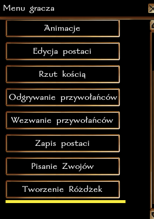
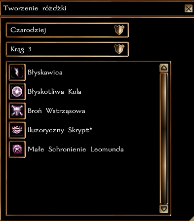

## Ogólne zasady

Tworzenie Różdżek działa na serwerze na tych samych zasadach co w podstawowej grze, z drobnymi modyfikacjami wymienionymi w następnej sekcji. (https://nwn.fandom.com/wiki/Craft_wand)

Oznacza to, że wymagany jest atut **Tworzenie różdżek**.

### Zmiany w stosunku do pierwotnej mechaniki gry

1. Tworzenie Różdżek dostępne jest z Menu Gracza.
2. Postać nie musi mieć zapamiętanego czaru, wystarczy, że go zna.

### Wskazówki

Puste różdżki (Kościana Różdżka) można zakupić w Neverwinter, w **Skrytowieży**.

### Krok po kroku

**1.**

**2.**

**3.**

