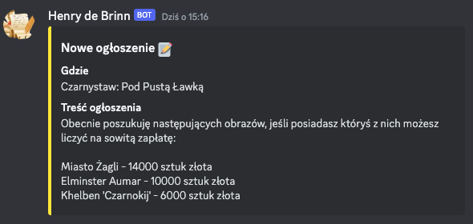
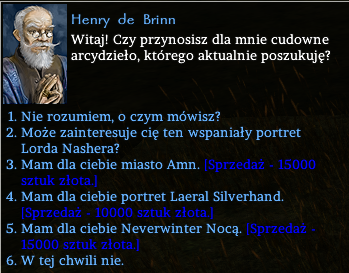

# Obrazy

Czasem w Skrzynkach z Kosztownościami lub Skarbach, postać może natrafić na obrazy przedstawiające znane osobistości lub miejsca, np. portret Elminstera lub pejzaż Port Llast.

Obrazy te można oczywiście kolekcjonować, ale jest też możliwość sprzedania ich kupcowi NPC. W przyszłości być może będzie także możliwość umieszczenia tych obrazów w domach postaci graczy.

### Sprzedaż obrazów
Raz na restart serwera, system losuje 3 obrazy, które będą skupowane danego dnia. Cena obrazów waha się od 6 do 15 tysięcy sztuk złota. Oznacza to, że czasem warto poczekać do następnego "dnia skupu", aby otrzymać lepszą cenę.

Lista skupowanych obrazów jest wyświetlana na kanale Discord [**#kolekcjoner**](https://discord.com/channels/752493729289601025/1342127948383391784).

\

