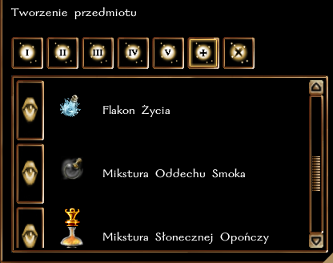

### Wymagania

**Charakter:** dowolny, oprócz Złego \
**Atuty:** Czujność, Żelazna Wola \
**Umiejętności:** Blef 4, Dyplomacja 8, Dyscyplina 4, Przeszukiwanie 2, Wiedza (Świat) 4, Wyczucie Pobudek 2 \
**Dodatkowo, ta klasa prestiżowa wymaga autoryzacji przez MG (fabularne dołączenie do Harfiarzy lub zatwierdzona Karta Postaci).**

### Atuty

**Stworzenie Przedmiotu Harfiarzy** \
**Rodzaj atutu:** Klasowy. \
**Wymagania:** Harfiarz Zwiadowca, poziom 5. \
**Opis:** Harfiarz uzyskuje dostęp do specjalnych wyrobów alchemicznych: Białej Wróżki, Flakonu Życia, Mikstury Oddechu Smoka, Mikstury Słonecznej Opończy i Zestawu Uzdrowiciela +10. \
**Użycie:** automatycznie.

### Zaklęcia

Harfiarz przygotowuje zaklęcia jak Bard **(oparte o modyfikator Charyzmy, spontaniczne)** i uzyskuje dostęp do następujących zaklęć. W odróżnieniu od Bardów i Czarowników, Harfiarz może uczyć się zaklęć ze zwojów.

### I

- Identyfikacja
- Kamuflaż
- Magiczna Broń
- Ochrona przed Charakterem
- Oplątanie
- Szybki odwrót
- Śliskość
- Uśpienie

### II
- Ciemność
- Cisza
- Kocia Zwinność
- Majestat Orła
- Niewidzialność
- Ultrawizja

### III

- Jasny Umysł
- Ostrość
- Przyspieszenie
- Spowolnienie