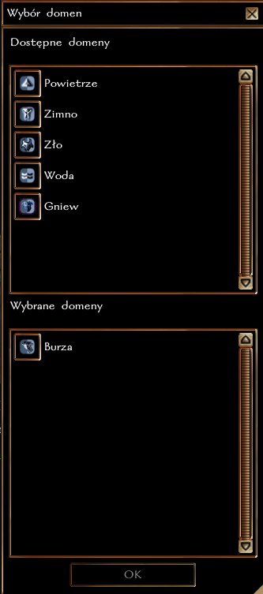

# Kapłan

### Wymagania

Przed rozpoczęciem gry kapłanem należy wysłać [kartę postaci](https://wiki.nwn.net.pl/karta-postaci) do MG. Dopiero po jej zatwierdzeniu można rozpocząć rozgrywkę.

### Kapłani w Faerûnie

Kapłani w świecie Zapomnianych Krain nie są zwykłymi użytkownikami magii, lecz przede wszystkim emisariuszami i sługami swoich bóstw. Ich moc oraz zaklęcia, jakie otrzymują od bóstwa opiekuńczego, są wynikiem długoletnich nauk, modlitwy oraz swoistą łaską, którą obdarowuje ich patron w zamian za przestrzeganie, oraz - przede wszystkim - wypełnianie dogmatu.\
Kapłani zobowiązani są przestrzegać zasad wiary, którą podążają - ich przekonania, działania oraz osobista agenda nie mogą stać w opozycji do dogmatu czy dziedzin bóstwa. Na przykład: kapłani Auril, bogini zimy, pod żadnym pozorem nie powinni wzniecać ognia i pożarów, a wręcz przeciwnie. Konsekwentne nieprzestrzeganie zasad własnej religii może skutkować **utratą łask**, a co za tym idzie **utratą zdolności do rzucania zaklęć** (również mechanicznie!). W takich przypadkach krnąbrni, bądź zwyczajnie zbłąkani kapłani, poddawani są obowiązkowej **Pokucie**, której niewypełnienie (na drodze *przygody/questa*) może skutkować **trwałym i nieodwracalnym** usunięciem kleryka spośród struktury kleru.

Każdy kleryk angażuje się w obowiązki religijne - modlitwy, różnego rodzaju rytuały oraz obchody unikalnych dla danego kościoła świąt. Przykładowo, kapłani Selûne obchodzą raz w roku Misterium Księżyca, podczas którego doświadczają ekstazy i osobiście rozmawiają ze swoją boginią, zaś klerycy Loviatar świętują Rytuał Bólu i Czystości wraz z nadejściem nowej pory roku, oddając się tańcom na potłuczonym szkle i dosyć ponurym praktykom samobiczowania.\
Słowem - każda religia Faerûnu posiada własny, unikalny zbiór zasad, obrządków i celebracji. 

Kapłani dobrych, powszechnie uważanych za pomocne, bóstw Faerûnu cieszą się zarówno szacunkiem jak i wielką czcią, zaś słudzy bóstw uchodzących za nikczemne, złe bądź mroczne - wzbudzają najczęściej jak najbardziej uzasadnioną trwogę. Obywatele miast Wybrzeża Mieczy z wielką uważnością przyglądają się działaniom boskich wysłanników, a co za tym idzie, każde ich działanie pośrednio odbija się na reputacji kościoła, a przez to ich bóstwa.\
W oczach przeciętnego mieszkańca Faerûnu nawet proste zasklepienie rany magią czy też wyleczenie przeciągającej się choroby jest istnym cudem, który zazwyczaj jest poza ich zasięgiem. Dostęp do magii objawień jest drogi, uważany nierzadko za przywilej szlachty oraz zamożnych mieszczan - dla zobrazowania skali: dniówka przeciętnego mieszkańca Wybrzeża Mieczy waha się od 1 srebrnika do 1 sztuki złota, zaś cena Mikstury Zdjęcia Choroby to w realiach Zapomnianych Krain aż 750 sztuk złota.\
Należy pamiętać, że awanturnicy i bohaterowie PC operują zupełnie innymi zasobami niż przeciętny plebejusz bez żadnej specjalizacji, dlatego też pojawienie się przyjaznego kapłana w mieście czy wiosce to dla wielu ludzi powód do radości i świętowania.

W świecie Zapomnianych Krain wszyscy posługujący się magią objawień **zobowiązani** są posiadać bóstwo opiekuńcze, gdyż mechanika tego świata nie pozwala na szeroko pojęty ateizm. Sama magia objawień - choć płynie ze Splotu - to zsyłana jest przez konkretne bóstwo, zwane patronem.

### Dostępne bóstwa

Lista wszystkich dostępnych mechanicznie bóstw na serwerze Kroniki Neverwinter dostępna jest w zakładce **[Bogowie](https://wiki.nwn.net.pl/docs/Podstawowe%20informacje/Bogowie).**

### Wybór domen

Każde bóstwo w Zapomnianych Krainach posiada własne portfolio wpływów, które koncentrują się na konkretnej, unikalnej dziedzinie. Portfolia z kolei dzielą się na obszary wpływów, z których korzystają kapłani - nazywa się je **domenami** i pozwalają one sięgać kapłanom po dodatkowe, zsyłane przez bóstwo zaklęcia.\
Kapłan wybiera domeny spośród tych, które są dostępne dla jego bóstwa, podczas edycji postaci w lokacji startowej.

### Nowe domeny kapłańskie

Poza domenami dostępnymi w standardzie, na serwerze są również następujące domeny:

- **Bestie** [Czary domenowe: Krwawy Szał (II), Zauroczenie Potwora (V), Unieruchomienie Potwora (VI)]
- **Blask** [Czary domenowe: Migoczące Barwy (I), Stożek Kolorów (VII)]
- **Ból** [Czary domenowe: Lecznicze Żądło (III), Kolczaste Pnącza (IV), Słowo Mocy: Ogłuszenie (VII)]
- **Burza** [Czary domenowe: Podmuch Wiatru (II), Wezwanie Błyskawic (III), Lodowa Nawałnica (V)]
- **Chaos** [Czary domenowe: Zamęt (III), Zamglony Umysł (V)]
- **Ciemność** [Czary domenowe: Ultrawizja (I), Czarne Macki Evarda (IV), Ekran (IX)]
- **Cierpienie** [Czary domenowe: Wyczerpanie (IV), Plugawy Uwiąd (VIII)]
- **Cierpliwość** [Czary domenowe: Spowolnienie (IV), Unieruchomienie Potwora (V)]
- **Chciwość** [Czary domenowe: Zlokalizowanie przedmiotu (II), Małe Schronienie Leomunda (III), Zlokalizowanie Stworzenia (IV); Specjalna moc: +10 miejsc w skrytce bankowej ]
- **Chwała** [Czary domenowe: Błogosławiona Broń (II), Aura Chwały (III)]
- **Czas** [Czary domenowe: Szybki Odwrót (I), Przyspieszenie (III), Grupowe Przyspieszenie (VI); dodatkowy atut: Ulepszona Inicjatywa]
- **Czystość** [Czary domenowe: Rozdzielająca Dłoń Bigby'ego (VI), Oczyszczenie Umysłu (IX)]
- **Dobroczynność** [Czary domenowe: Małe Schronienie Leomunda (III); Specjalna moc: czary leczenia ran wzmocnione]
- **Drowy** [Czary domenowe: Jasnowidzenie/Jasnosłyszenie (II), Większe Związanie Sfer (VIII)]
- **Duma** [Czary domenowe: Boska Moc (III), Grupowe Zauroczenie Potwora (VIII)]
- **Elfy** [Czary domenowe: Kocia Zwinność (II); dodatkowy atut: Strzał z Bliska]
- **Fey** [Czary domenowe: Oplątanie (I), Korowa Skóra (II), Podziemne Pnącza (V)]
- **Gniew** [Czary domenowe: Krwawy Szał (II), Okrzyk Bitewny (IV)]
- **Gnomy** [Czary domenowe: Niemy Obraz (I), Mniejszy Obraz (III), Mniejsze Tworzenie (IV), Ekran (VIII)]
- **Gorliwość** [Czary domenowe: Większe Rozproszenie Magii (V), Słowo Wiary (VI)]
- **Handel** [Czary domenowe: Poznanie Myśli (II), Oczyszczenie Umysłu (VIII); Specjalna moc: +4 do Wyceny]
- **Hojność** [Czary domenowe: Poznanie Myśli (II), Prawdziwe Widzenie (IV)]
- **Iluzje** [Czary domenowe: Niemy Obraz (I), Większy Obraz (II), Przemieszczenie (III), Widmowy Zabójca (IV), Wprowadzenie w Błąd (VI), Ekran (VIII)]
- **Jaskinie** [Czary domenowe: Wykrycie Sekretnych Drzwi (I), Małe Schronienie Leomunda (III), Kamienne Więzy (VI), Trzęsienie Ziemii (VII)]
- **Krasnoludy** [Czary domenowe: Kamienna Skóra (IV), Ochrona przed Czarami (VIII)]
- **Księżyc** [Czary domenowe: Nieustający Obraz (VI); Specjalna moc: Odpędzanie Lykantropów]
- **Lenistwo** [Czary domenowe: Uśpienie (I), Małe Schronienie Leomunda (III), Spowolnienie (IV)]
- **Łowy** [Czary domenowe: Jedność z Ziemią (II), Zlokalizowanie stworzenia (IV); Dodatkowy atut: Zmysł Natury]
- **Metal** [Czary domenowe: Ostra Krawędź (III), dodatkowy atut: Używanie Broni Bojowej]
- **Nienawiść** [Specjalna moc: Czar Zagłada zapewnia dodatkowo karę -2 do wszystkich atrybutów, Czary Zadawania Ran są automatycznie wzmocnione (tylko kostki)]
- **Nie-śmierć** [Specjalna moc: Kapłan przywołuje potężniejszych Nieumarłych]
- **Niziołki** [Czary domenowe: Kocia Zwinność (II), Swoboda Ruchu (III)]
- **Noc** [Czary domenowe: Wezwanie Cieni (V), Cienie (VII), Specjalna moc: Ultrawizja]
- **Obżarstwo** [Czary domenowe: Lecznicze Żądło (III), Wampiryczny Dotyk (IV), Szkodliwa Polimorfia (V), Kamień w Ciało (VII)]
- **Ocean** [Czary domenowe: Oddychanie pod Wodą (II), Stożek Zimna (VI), Rój żywiołów (IX)]
- **Odnowienie** [Czary domenowe: Zauroczenie Osoby (I), Usunięcie Choroby (II), Reinkarnacja (IV); Specjalna moc: Raz na odpoczynek, jeśli punkty życia kapłana spadną poniżej 0, zostaje automatycznie uleczony do 1 HP]
- **Orkowie** [Czary domenowe: Boska Moc (III), Strach (IV)]
- **Plagi** [Czary domenowe: Zakażenie (II), Trujące Kolce (III), Pełzająca Zagłada (VII)]
- **Planowanie** [Czary domenowe: Jasnowidzenie/Jasnosłyszenie (III), Wykrycie Wróżenia (V)]
- **Pokora** [Czary domenowe: Promień Osłabienia (I), Wyczerpanie (IV), Opończa Czarów (VII)]
- **Portal** [Czary domenowe: Wstrzymanie Portalu (II), Niematerialne Oblicze (VII)]
- **Pożądanie** [Czary domenowe: Zauroczenie osoby (I), Niewidzialność (II), Jasnowidzenie/Jasnosłyszenie (III), Sojusznik ze Sfer (IV), Grupowe Zauroczenie Potwora (VIII)]
- **Prawo** [Czary domenowe: Unieruchomienie Osoby (I), Unieruchomienie Potwora (IV)]
- **Przeznaczenie** [Czary domenowe: Wizja (VII), Oczyszczenie Umysłu (VIII); Dodatkowy atut: Uniki]
- **Przyjemność** [Czary domenowe: Przywrócenie (III), Większe Przywrócenie (VI); Specjalna moc: +2 Blef, +2 Dyplomacja]
- **Radość** [Czary domenowe: Ohydny śmiech Tashy (II), Specjalna moc: +4 do testów Dyplomacji]
- **Reptilioni** [Czary domenowe: Trucizna (III), Pełzająca zagłada (VII), Specjalna moc: odpędzanie Reptilionów]
- **Rodzina** [Czary domenowe: Ochrona przed Czarami (VIII)]
- **Równowaga** [Czary domenowe: Wygnanie (V), Ochrona przed Czarami (VIII), Równowaga Natury (IX)]
- **Runy** [Czary domenowe: Wymazanie (I), Glif Strażniczy (II), Mniejsze Związanie Sfer (V), Natychmiastowe Przywołanie Drawmij'a (VII); Dodatkowy atut: Pisanie Zwojów]
- **Rzemiosło** [Czary domenowe: Ożywienie Liny (I), Mniejsze Tworzenie (IV), Większe Tworzenie (VII), Klatka Mocy (VIII)]
- **Sen** [Czary domenowe: Uśpienie (I), Widmowy Zabójca (IV), Słowo Mocy: Ogłuszenie (VII)]
- **Społeczność** [Czary domenowe: Modlitwa (II), Dodatkowy atut: Talent (Dyplomacja)]
- **Szczęście** [Czary domenowe: Przełamanie Czaru (V), Wprowadzenie w Błąd (VI); Dodatkowy atut: Szczęście Bohaterów]
- **Szlachectwo** [Czary domenowe: Aura Chwały (III), Dominacja: Osoba (V)]
- **Tyrania** [Czary domenowe: Strach (IV), Grupowe Zauroczenie Potwora (VIII), Dominacja Potwór (IX)]
- **Urok** [Czary domenowe: Zauroczenie Osoby (I), Zauroczenie Potwora (V), Dominacja Potwór (IX)]
- **Utopienie** [Czary domenowe: Oplątanie (I), Utopienie (VI), Plugawy Uwiąd (VIII); Specjalna moc: Niewrażliwość na czar Utopienie oraz specjalną zdolność utopienia Żywiołaków Wody.]
- **Wieczny Spoczynek** [Czary domenowe: Śmierć Nieumarłych (V); Specjalna moc: Odporność na Magię Śmierci]
- **Wstrzemięźliwość** [Czary domenowe: Większe Rozproszenie Magii (V), Słowo mocy: Ogłuszenie (VII)]
- **Wytrwałość** [Czary domenowe: Kamienna Skóra (IV), Klosz Niewrażliwości (VI), Opończa Czarów (VII)]
- **Zachłanność** [Czary domenowe: Identyfikacja (I), Kołatka (II), Emocja (IV), Specjalna moc: +10 miejsc w skrytce bankowej]
- **Zaklęcia** [Czary domenowe: Zbroja Maga (I), Przełamanie Czaru (V); Specjalna moc: +2 do Koncentracji i Czaroznastwa]
- **Zazdrość** [Czary domenowe: Promień Osłabienia (II), Wampiryczny Dotyk (IV); Specjalna moc: +2 do Blefu]
- **Zemsta** [Czary domenowe: Tarcza Żywiołów (IV), Opończa Czarów (VII)]
- **Zimno** [Czary domenowe: Lodowa Nawałnica (IV), Stożek Zimna (VI)]
- **Zmiana** [Czary domenowe: Zmiana Siebie (II), Polimorfia (V), Zmiana Kształtu (IX)]
