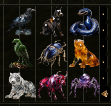
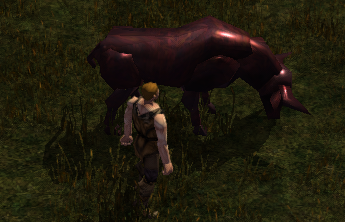
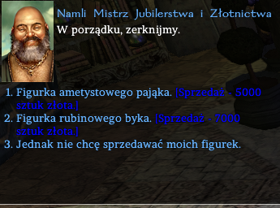

# Figurki

Czasem postać może natrafić na wyjątkowy przedmiot - kryształową figurkę. Jest 9 różnych typów figurek i można na nie natrafić w Skrzynkach z Kosztownościami, Skarbach, a czasem nawet w zwyczajnej skrzynce lub przy ciele potwora. Każda z nich przedstawia zwierzę lub owada.

\

Każda z figurek pozwala na przywołanie potężnej magicznej istoty - raz dziennie. Przywołany potwór służy posiadaczowi przez 24 godziny czasu gry lub do momentu odesłania/odpoczynku. Stwory różnią się siłą oraz zdolnościami.

\
Z czasem magia figurki wyczerpuje się (50 ładunków).

### Sprzedaż figurki

Niezależnie od tego czy figurka wciąż posiada ładunki, zawsze jest opcja aby ją sprzedać jubilerowi z Neverwinter (Czarnystaw: Rezydencje - Kryształowa Róża). Zapłaci on dobrą cenę.

\