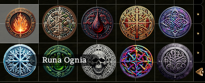

# Przedmioty runiczne

W grze można znaleźć przedmioty, które posiadają miejsca na runy, zarówno broń jak i zbroje, pierścienie, amulety czy inne typy ekwipunku (między innymi, zmodyfikowane wersje przedmiotów z palety standardowej gry).

Maksymalna ilość miejsc na runę to 3.

### Runy

W grze występuje **12 rodzajów run**. Może z nich korzystać każda klasa, bez żadnych ograniczeń czy specjalnych wymagań. Wystarczy użyć runę na przedmiocie (oczywiście przedmiot musi posiadać wolne miejsce na runę!). To samo dotyczy odporności.

Moc run na przedmiocie kumuluje się, co oznacza, że sztylet, który ma 3 Runy Mrozu ma premię do obrażeń +3k4 Zimno.

#### Runa Mocy

- Na broni: +1 ulepszenie lub +1 ataku i +2 potężny (broń dystansowa)\
- Pozostałe przedmioty: +1 do KP lub +1 do cechy (jeśli przedmiot zapewnia premię do cechy)

#### Runa Ognia

- Na broni: Premia do obrażeń: +1k4 Ogień\
- Pozostałe przedmioty: Odporność na obrażenia: -5 Ogień

#### Runa Mrozu

- Na broni: Premia do obrażeń: +1k4 Zimno\
- Pozostałe przedmioty: Odporność na obrażenia: -5 Zimno

#### Runa Ziemi

- Na broni: +2 KP\
- Pozostałe przedmioty: Redukcja obrażeń 3/-

#### Runa Błyskawicy

- Na broni: Premia do obrażeń: +1k4 Elektryczność\
- Pozostałe przedmioty: Odporność na obrażenia: -5 Elektryczność

#### Runa Cienia

- Na broni: Premia do obrażeń: +1 Cień, Ciemność 1x dziennie\
- Pozostałe przedmioty: Ukrycie 5%

#### Specjalne zasady:

Cień to specjalny typ obrażeń, reprezentujący Magię Cienia (praktycznie nieredukowalny)
ulepszony przedmiot staje się Przedmiotem Cienistego Splotu
premia do ukrycia sumuje się z Unikiem Cienia Tancerza Cieni i DODATKOWO zapewnia +1 KP do premii z Uniku Cienia za każdą runę
premia uzyskana z kilku przedmiotów nie sumuje się (czyli maksimum to 15% ukrycia)

#### Runa Trucizny

- Na broni: Premia do obrażeń: +1k4 Kwas\
- Pozostałe przedmioty: Odporność na obrażenia: -5 Kwas

#### Runa Magii

- Na broni: Premia do obrażeń: +1k4 Magiczne\
- Pozostałe przedmioty: Odporność na obrażenia: -5 Magiczne

#### Runa Czaszki

- Na broni: Premia do obrażeń: +1k4 Negatywna Energia\
- Pozostałe przedmioty: Odporność na obrażenia: -5 Negatywna Energia

#### Runa Błogosławiona

- Na broni: Premia do obrażeń: +1k6 Pozytywna Energia przeciwko Nieumarłym\
- Pozostałe przedmioty: Odporność na obrażenia: +3 KP przeciwko Nieumarłym

#### Runa Wampira

- Na broni: Wampiryczna Regeneracja 4\
- Pozostałe przedmioty: Szybkie Leczenie +1

#### Specjalne zasady:

Szybkie Leczenie to typ regeneracji, który się nie sumuje z kilku przedmiotów (czyli leczenie maksimum 3 punkty wytrzymałości co rundę)
Runa Chaosu
Runa Chaosu może dać dowolny efekt replikujący działanie pozostałych 11 run (losowany podczas ulepszania).

### Ulepszanie przedmiotów

Próba ulepszenia przedmiotu może mieć 3 różne rezultaty:

- Sukces: przedmiot został ulepszony, runa stapia się z przedmiotem
- Wadliwa runa: runa rozpada się, przedmiot pozostaje bez zmian
- Porażka ulepszania: runa rozpada się wraz z ulepszanym przedmiotem
- Podczas procesu ulepszania przedmiot może mieć [początkowo] 0, 1 lub 2 runy.

| Ilość run w przedmiocie | Szansa % - sukces | Szansa % - utrata runy | Szansa % - utrata przedmiotu |
|-------------------------|-------------------|------------------------|------------------------------|
| 0                       | 75                | 15                     | 10                           |
| 1                       | 50                | 25                     | 25                           |
| 2                       | 25                | 25                     | 50                           |

### Aura przedmiotu (efekt wizualny broni)

- Broń z 1 runą nie posiada efektu wizualnego.
- Broń z 2 lub 3 runami danego typu posiada efekt wizualny dominującego typu, np. miecz 2 Runy Ognia i 1 Runa Mrozu zdaje 2k4 ogień + 1k4 zimno dodatkowych obrażeń i posiada efekt wizualny "ogień". Fabularnie jest to przedmiot z aurą ognia.
- Broń z 2 runami różnych typów, np. Runa Czaszki + Runa Mrozu zadaje 1k4 negatywna + 1k4 zimno i nie posiada żadnego efektu wizualnego.