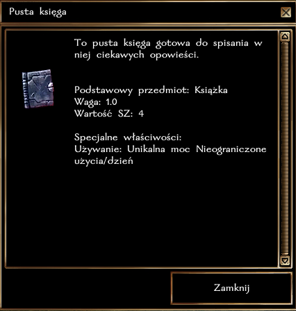
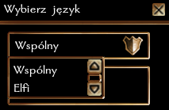
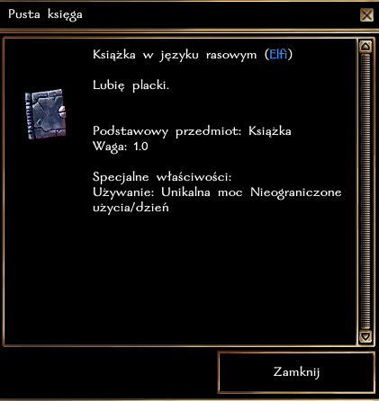
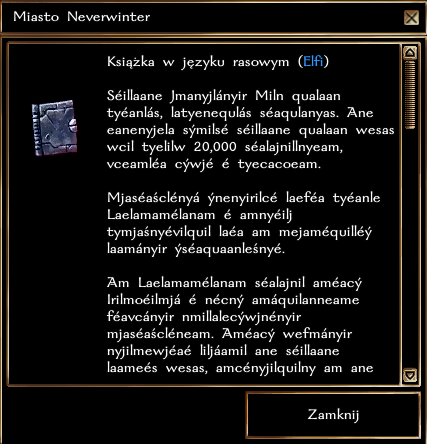

# Pisanie notatek

### Ogólne zasady
Postacie graczy mogą pisać wiadomości lub zapisywać księgi. Wystarczy zakupić odpowiedni przedmiot. Czyste pergaminy są szeroko dostępne w świątyniach i sklepach magicznych, jednak najszerszy asortyment posiada Maskado w Neverwinter.

### Treść w języku rasowym
Przy pierwszym użyciu danej księgi lub pergaminu do pisania, postać może wybrać czy pisać w języku wspólnym, czy też w innym języku, którym postać się biegle posługuje (co najmniej 75 punktów języka).

Wiadomości zapisane w języku rasowym mogą być odczytane jedynie przez postacie, które rozumieją dany język.

### Krok po kroku

**Książka w języku rasowym - widok postaci, która nie zna wymaganego języka**

