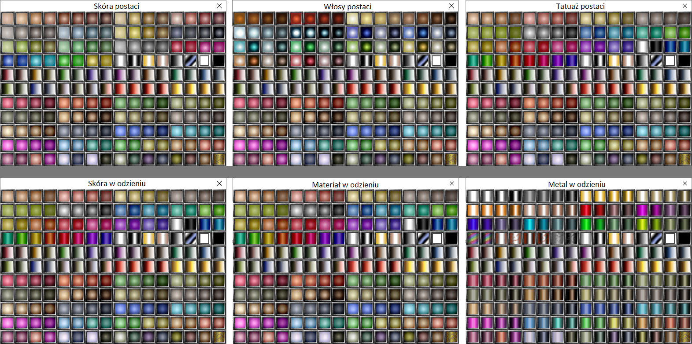

Chociaż nasza ekipa dokłada wszelkich starań, aby zapewnić najwyższą jakość rozgrywki, czasami też się mylimy.\
Pewne błędy czy ulepszenia wymagają również większej ilości czasu.

Poniżej znajdują się ogólne informacje, a lista konkretów jest dostępna na forum [`bugi`](https://discord.com/channels/752493729289601025/1147127141226520627) na Discrodzie.

## Poniżej znajduje się lista znanych niedogodności

### 1. Edycja wyglądu postaci i ubioru

Wciąż pracujemy nad wyeliminowaniem wszystkich błędów na Manekinie i w Lustrze.\
Głównym mankamentem są obecnie nieprawidłowo wyświetlone ikonki kolorów. Kolory nakładają się prawidłowo, jako pomoc można użyć poniższego screenshota by zobaczyć właściwą ikonę kolorów (kolory są w poprawnych miejscach w NUI):\

### 2. Dialogi i questy mechaniczne

Ilość dialogów u NPC jest ograniczona, z czasem dla urozmaicenia rozgrywki będzie ich więcej.\
Questy mechaniczne nie wszystkie jeszcze działają i w przyszłości chcemy dorobić kolejne.

### 3. Lokacje i systemy

Zaimplementowaliśmy sporo systemów do urozmaicenia lokacji i eksploracji, jednak jeszcze nie wszystko udało się wprowadzić w życie na module. Stopniowo będą dochodzić, tak jak i dodatkowe obszary.

### 4. Klasy

Kilka elementów w klasach/atutach/umiejętnościach wymaga wciąż doszlifowania. Nowe klasy również będą dochodzić w późniejszym terminie.
